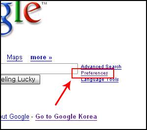
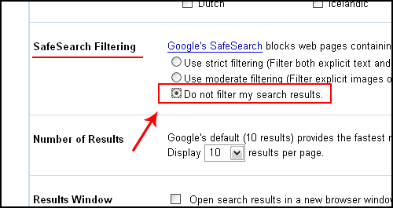
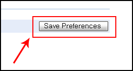
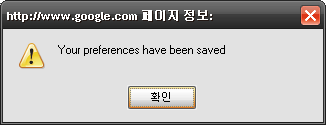
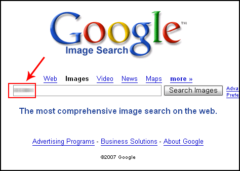
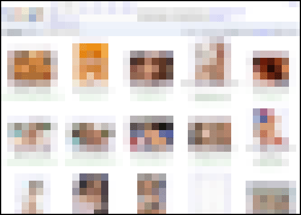

> (전략)  
>   
> 22일 오후 기자가 광화문에 위치한 정보통신부 13층 기자실에서 세계 최대의 검색사이트인 구글 초기화면을 통해 특정 키워드를 입력하자 4억개가 넘는 관련 웹페이지들이 검색됐으며, 이 가운데 맨 위에 검색된 페이지를 클릭해 관련 사이트에 접속하자 눈 뜨고 보기에 민망한 사진들이 무차별적으로 쏟아져 나왔다.  
>   
> (중략)  
>   
> 이와 관련, 정보통신부 이태희 정보윤리팀장은 “구글의 경우는 관련 서버가 해외에 있다는 것으로 정보통신윤리위가 권고한 검색 금칙어 설정을 하지 않고 있어 문제가 발생되고 있다”면서 “앞으로 정통부는 구글측에도 행정지도 등을 통해 이같은 문제를 원천 봉쇄할 예정이며, 오는 26일 관련 대책을 발표할 때 이같은 사항도 포함시키겠다”고 말했다.  
>   
> 이에 대해 구글코리아 정김경숙 홍보실장은 “현재 구글도 이같은 상황을 인식하고 있으며, 프로그램을 통한 차단 방식 등을 도입해 음란물 검색을 원천 차단할 수 있도록 대책 마련 계획하고 있다”면서 “세이프서치(SafeSearch)라는 프로그램을 통해 한글 단어나 문맥, URL 등의 검색어를 필터링할 수 있도록 한국에도 적용하는 방안을 추진할 예정”이라고 밝혔다.  
>   
> (후략)  
>   
> 출처 : [디지털데일리 - 구글 음란물 노출 무방비, 국내 포털보다 ‘상황 심각’](http://www.ddaily.co.kr/news/?fn=view&article_num=22170)

<!-- truncate -->

  
  
이 기사는 조금 이상하다. 사실 구글 코리아 (google.co.kr)의 경우는 이미 원천적으로 필터링이 되어 있는 상태이기 때문이다. 구글 코리아의 검색 결과는 특정 기준에 의해 필터링이 되어 있는 상태이고 사용자가 이 설정을 해지할 수 없다는 점에서 노력을 하고 있는 것이라 할 수 있다. 물론 한국 법인이 생기기 전부터 이 필터링은 작동하고 있었다.  
  
자, 그럼 이제 본격적으로 구글에서 성적인, 하드코어한, 음란한 사진들을 찾아보자.  
  

**1** [영문 구글](http://www.google.com)에 접속한다. 만약 자동으로 [구글 코리아](http://www.google.co.kr)로 포워딩 된다면 이 주소로 간다. http://www.google.com/ig?hl=en  
  
  
**2** preferences를 클릭해 들어간다.  
  
  
**3** 중하단부에 있는 SafeSearch Filtering 옵션을 Do not filter my search results로 변경하고,  
  
  
**4** 저장(save)을 하면 필터링을 해지한 것이다.  
  
  
**5** Images 를 눌러서 Google Images로 간 후 원하는 검색어를 입력한다.  
  
  
**6** '음란한' 이미지들이 쏟아져 나온다.  
(주의: 직장에서 따라하다간 큰 일 날 수도 있다. NSFW!)  
  

  
몇몇의 우리는 통제에 길들여져 있다.  
아무리 발버둥쳐도 도를 넘지 않는 절대적인 통제장치가 있길 바란다.  
악도 선도 그 안에 존재하기를 원한다.  
그렇지 않으면 우리가 또 다른 누군가를 통제할 방법도 없기 때문이다.  
  
그렇다면 과연 인터넷은 신천지인가.  
아니라면 기존 세상의 영향을 얼마나 받고 있는 것일까.  
정보의 유통은 얼만큼 자유로운가.  
그리고, 음란물이란 누가 규정하는가.  
  
우리 (성인)에게는 음란물을 볼 권리가 없는 것일까?  
음란물을 보는 행위가 누군가에게 해로운 행위이기 때문일까?  
국가가 어떠한 것들을 음란물이라 규정짓고, 포르노라 규정짓고  
합법적인 유통 자체를 철저히 금지시킬 수 있는 근거는 무엇일까?  
  
중국이 티벳을 침공했을 때 구글 차이나가 중국 정부의 의견을 받아들여  
그와 관련된 웹페이지들을 차단하고 필터링해서 검색결과에서 제외시켰을 때  
많은 사람들이 흥분했다.  
  
그렇다면, 이 '음란물 검색'건은 어떤가.  
음란물과 정치적인 사건은 서로 '급이 다르니' 비교할 수 없는 걸까?  
전세계가 인터넷으로 연결된 세상에서  
국민을 상대로 필터링을 하는 건 어느 선까지 가능한 걸까.  
  
글쎄…  
  
몇몇의 우리는 보고 싶은 것만 보며 산다.  
그 몇몇의 우리는 자유를 두려워 하기 때문이다.  
하지만, 난 적어도 보여주는 것만 보며 살고 싶진 않다.
