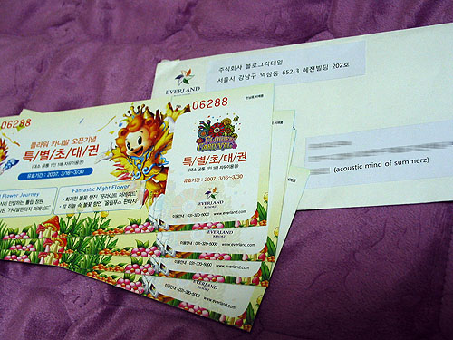
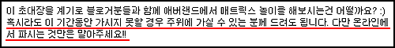

  
사실 에버랜드 특별초대권을 올블로그로부터 받은지는 오래 되었다. 뜻하지 않은 선물이었기에 기분이 좋았고, 곧 조카 생일이라 누나에게 표를 건넸다. 따라서 조카들은 조만간 즐거운 시간을 보낼 수 있지 않을까 싶은 생각이 들어 기분이 좋다.  

<!-- truncate -->

올블 측에서는 여느 다른 경품 (컵, 옷 등)들과는 달리 상품권 성격의 선물이기 때문에 우려가 있었던지 당부의 말을 함께 전했었다.  
  
  
내가 이 글을 적는 이유는 어느 커뮤니티 게시판에서 이 티켓을 파는 걸 보고 나서 기분이 나빠졌기 때문이다.  
  
정확히 말하자면 한 블로거가 이 티켓을 파는 건지는 정확하지 않다. (직접 물어본 건 아니니까.) 하지만, 여러 정황 증거로 봤을 때 상당히 분명한 듯 싶다. 파는 사람의 이메일 아이디와 필명은 올블로그가 선정한 탑블로거 명단에 있는 사람과 일치하고, 그가 파는 표도 정확히 경품으로 받은 플라워 카니발 오픈기념 특별초대권이기 때문이다.  
  
캡쳐를 해 두었지만 그저 어느 한 개인을 비난하는 글로 비칠까 싶어 글을 올리려는 생각은 그만 두었다. 하지만, 표 4장 팔아봐야 기껏 십만원 정도인데, 선물을 보낸 사람의 호의와 당부를 무시하는 행동을 본 건 여전히 씁쓸하다.  
  
평상시에 난 '기업은 인격이 없다', '기업은 자비심이 없다'고 생각을 한다. 개개인들은 모두 착하지만 그런 개인들이 모여 매우 비열하고, 파렴치한 운영을 하는 기업이 있을 수도 있기 때문이다. 더군다나 기업은 기업의 이익을 최우선으로 여긴다고 보는 게 일반적인 관점 아닌가. 고객 서비스를 잘 하는 기업의 목적도 결국은 그런 식의 성실함으로 신뢰를 쌓아 더 많은 이익을 창출하려는 것 아닌가. 그리고 (당연히) 그런 게 나쁜 것도 아니고.  
  
그렇다면 블로거는 무엇일까. 개인일까? 여느 기업처럼 그냥 하나의 개체일까? 아니면, 현실과는 다른 또 하나의 자아일까?  
  
난 그저 선물을 판 하나의 글을 본 것 뿐인데, 내가 괜히 미안해진다.
