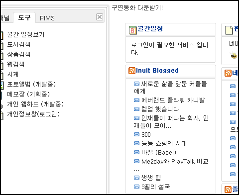
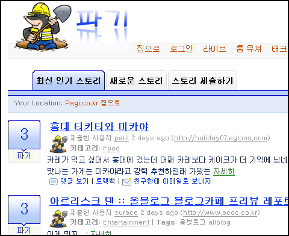

제목이 그리 문법에 맞지는 않지만 어쨌든 그렇습니다. 최근에 [미투데이](http://me2day.net)라든지 [플레이톡처럼 공개가 되기 전부터 혹은 공개 초기부터 관심을 끄는 서비스가 있는 반면 점점 모양새를 갖춰가고 있는데도 잘 알려지지 않은 서비스들도 있습니다.  

<!-- truncate -->

  
그런 의미의, 개발 중이거나 운영 중인, 아직 잘 알려지지 않은 서비스 두 가지 입니다.  
  

첫째. [개인화 그룹웨어 **퍼니온**](http://www.funion.net)  
  
  
언뜻 봐서는 [위자드 닷컴](http://wzd.com/)과 비슷한 것도 같지만 그룹웨어라든지 개인 웹하드 같은 메뉴들을 볼 때 서비스가 완성이 되면 그보다는 규모가 더 클 것 같습니다.  
  
아직 서비스가 개발 중이지만, 지금만으로도 RSS 리더기 역할은 충실히 할 듯 합니다. 속도도 좋고요.

  

둘째. [웹 2.0 뉴스 소셜 사이트 **파기**](http://pagi.co.kr/)  
  
  
서비스 이름이 재밌어서 처음 봤을 때 웃었던 기억이 납니다. 뭐랄까 이름에서부터 철저히 한국판 [디그닷컴](http://digg.com)이라고 이야기하는 것 같아서요. [뉴스2.0](http://news2.co.kr)이 나름대로 미디어의 측면을 고려하며 디그닷컴을 모사했다면, 이 서비스는 '내가 디그닷컴의 적자'라고 당당히 선언하는 듯 합니다. (물론 기능적인 측면은 아직 많이 떨어지지만요)  
  
아직 인터페이스에 '묻어버리기' (bury it)은 없군요. :)](http://playtalk.net)
