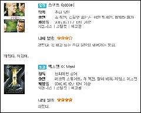
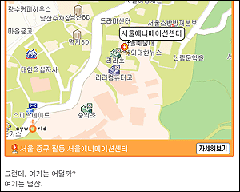

C2로 명명되었던 싸이월드의 새로운 서비스는 클로즈드 베타 서비스를 거쳐 현재 [**홈2**](http://home.cyworld.nate.com/)라는 이름으로 변경되어 오픈 베타 서비스 중입니다. 아래 글은 클로즈드 베타 서비스일 때 서비스를 사용하고서 작성한 글이예요. 조금 늦은 것도 같지만 요약해서 올립니다.  

<!-- truncate -->

\* \* \*  
미리 슬쩍 들여다본 C2는 세 개의 핵심 서비스로 요약되고 있었다. 멀티계정, 홈, 마이베이스가 바로 그것이다. 이 단어들이 무엇을 의미하는지 자세히 들여다보자.  
  

싸이월드의 C2의 핵심요소 - 멀티계정, 홈, 마이베이스  
  
멀티계정 - 1인 1계정을 원칙으로 하던 기존의 정책을 버리고, 실명으로 사용하던 미니홈피 계정 외에 닉네임으로 활동이 가능한 홈을 두 개 더 만들 수 있다.  
  
홈 - 좁은 미니홈피라는 공간을 벗어나서 드디어 화면 전체를 사용할 수 있게 되었다.  
  
마이베이스 - 일종의 "내 기록의 데이터베이스"이다. 자신이 이제껏 작성한 글을 한 자리에서 확인할 수 있고, 일촌과의 관계, 각종 알림 사항도 전달받을 수 있는 C2의 기반이라 할 수 있다.

  
[c2-1.gif](./c2-1.gif)**싸이월드에 멀티계정의 시대가 열리다**  
  
C2의 가장 큰 특징 중 하나는 바로 ‘멀티계정 지원’이다. 사실 이는 이미 몇몇 다른 업체에서는 채택하고 있는 정책이다. 네이버 블로그 오래 전부터 하나의 주민등록번호로 아이디를 최대 세 개까지 만들 수 있으며, 티스토리는 주민등록번호를 아예 받지 않는다. (물론 티스토리는 아직 초대로만 가입을 받는 베타서비스이긴 하다)  
  
싸이월드가 강조해 온 실명기반의 서비스는 다른 인터넷 업체들의 서비스와는 차별화된 장점이면서도 한계였다. 유저들은 오프라인과 같은 기분을 느끼며 상대방과 빨리 친해질 수 있었지만, 정작 자기 자신에게는 솔직하지 못한 공간을 만들어가는 이유였다. 무슨 사고만 터지면 싸이월드부터 찾아보는 요즘 세대들이 자신의 미니홈피에 가벼운 이야기들로만 채우는 건 그들이 단지 한심하기 때문만은 아닐 것이다. 친한 사람들에게 공개된 일기장과 포토앨범에 험하거나 싫은 이야기, 솔직한 이야기를 온전히 남길 수 있는 사람이 얼마나 있을까. 또한 대부분은 공개되지 않는 비공개로 감춰두기 일쑤이다.  
  
이런 면에서 볼 때 멀티 계정은 적절한 돌파구라 볼 수 있다. 그동안 지나친 개인정보 유출이 싫어 싸이월드를 떠났던 유저들을 다시 불러들일 수도 있고, 가식적인 이야기 대신 솔직한 내용들을 채우고 싶은 개인들의 욕구도 충족시킬 수 있는 기회이다.  
  
> 멀티계정을 영어로 번역하면 뭐라고 할까? C2는 Multi Identity 라고 표현했다. 그럼 Multi Identity를 다시 한글로 번역하면 뭐라고 할 수 있을까? 처음 떠오른 단어는 "다중인격"이었다. 이제 헤어진 연인의 미니홈피를 스토킹하다가 덜컥 이벤트에 걸려서 들통이 나는 그런 시대는 갔다. 바야흐로 싸이월드에도 가면무도회의 시대가 열린 것이다. (물론 다중인격의 바른 영문 표기법은 multiple personality이다.)

  
[c2-2.gif](./c2-2.gif)**오리가미 (종이접기)와도 같은 홈**  
  
솔직히 C2는 어려운 서비스이다. 운이 좋다면 미니홈피의 인기를 이어갈 수 있을 것이고, 이걸 가능하게 만들어주는 전진기지가 바로 "홈"이다. "홈"은 기존의 미니홈피를 대체하는 새로운 공간의 유저 공간이며 쉽게 말하면 "넓어진 미니홈피"이다. 유저들은 크고 넓어진, 디자인까지 새로 할 수 있는 "홈"을 가지게 된 것이다. 마치 종이에 도안을 하고 가위로 슥슥 오려서 원하는 모양을 접는 오리가미 (종이접기)처럼 마음대로 자신이 원하는 메뉴를 꺼내놓을 수도 있고, 필요 없는 메뉴는 삭제할 수도 있고 배치도 자유롭다.  
  
이 "홈"의 외형적인 특징은 세 가지이다. 하나, 여러 기능을 하는 웹위젯. 둘, 제목과 메뉴에 원하는 폰트를 적용하면 이를 실시간으로 이미지화 시켜주는 기능, 셋, 리뷰 게시판에 관련 정보를 쉽게 찾아 삽입시키는 기능과 지도 삽입 기능의 탑재. 이는 다른 홈페이지/블로그 서비스에서는 볼 수 없는 C2만의 특징이다.  
  

영화정보 사이트와 같은 편집

지도도 삽입이 가능하다

  
반면 여러 게시판으로 이루어진 메뉴들은 사실 하나의 게시판 프로그램을 여러 형태로 보여주는 것에 지나지 않는다. 기존의 미니홈피 유저들을 위해 이렇게 여러 형태의 메뉴로 나누어 구성했겠지만, 반대로 이야기하자면 이건 거의 눈 가리고 아웅하는 수준이라고 볼 수도 있다. 별로 특이할 게 없는 다중 게시판 시스템을 단지 메뉴과 스킨의 차이로 구분해 놓은 것이기 때문이다. 블로그라면 카테고리를 나누는 것만으로 가능한 방법이지 않을까.  
  
또한 게시판을 블로그형으로 해도 트랙백을 할 수 있는 주소는 보이지 않았고 RSS 또한 클로즈드 베타 기간 동안에는 어떻게 작동하는지 확인 할 수 없었다. (물론 후에 어느 정도 정리되어 지원될 거라 예상한다.) 문득 드는 생각 - 그런데, C2는 과연 열려있는 서비스인걸까?  
  
[c2-6.gif](./c2-6.gif)다시 한번 말하는데 C2는 (이전에 비해) 쉽지 않은 서비스이다. 미리 초청된 열혈 유저들인 ‘리드 유저’들 조차 새로이 등장하는 개념과 규칙에 대해 헷갈려 하고 싸이월드측은 반복적으로 그 기능들에 대해 홍보를 하고 있다. 그런 면에서 볼 때 이 **"홈"**이라는 명칭은 너무나도 아쉬운 작명이다. 다른 수많은 후발주자들로 하여금 "이 서비스는 미니홈피와 비슷한…", "이 서비스는 미니홈피와는 차별화된…" 등의 이야기를 이끌어 냈던 기존의 독보적인 브랜드 "미니홈피"를 버리고 새로 만드는 브랜드가 고작 "홈"이라니. 학습해야 할 게 많은 C2를 네이버나 다음(과 태터툴즈의 티스토리) 등과 비슷하게 보이려는 의도가 아닌 이상에야 나중에 싸이월드 측에서 두고두고 후회할 요소가 아닐까 싶다.  
  
**내 정보를 관리하는 곳, 마이베이스**  
  
C2라는 서비스의 규모가 굉장히 크기 때문인지 자신이 작성한 글과 일촌과의 관계에 대한 정보를 관리하는 부분이 "마이베이스"라는 이름으로 따로 떨어져 나오게 되었다. 쉽게 말하면 글과 인맥을 통합 관리하고 과거와 현재를 연결시켜주는 창고라고 할 수 있다. 자신이 작성한 글을 모아서 함께 보관하는 데이터베이스이기도 하고, 일촌과의 관계를 보다 자세하게 설명해주는 공간이기도 하고, 자신이 가지고 있는 각종 게시판 등에 남겨진 댓글 등을 알려주는 알림판이기도 하다.  
  
아직(?) 마이베이스의 글 관리 기능은 미니홈피의 고질적인 문제점인 백업문제를 해결하지는 못했지만 그래도 자신이 여러 계정을 통해 남긴 글들을 한 번에 분류, 삭제할 수도 있는 기능과 하나의 글을 여러 계정과 자신이 참여하는 클럽에 보낼 수 있는 출판 기능 (보내기)와 필요한 글을 책갈피하는 기능은 C2만의 특화된 서비스라 할 수 있다.  
  
**인수 합병으로 커온 SK커뮤니케이션즈 시험 무대에 오르다.**  
  
이쯤해서 SK커뮤니케이션즈의 능력에 대해 한번쯤 생각해 보게 된다. 사실 이제껏 SK커뮤니케이션즈의 능력은 제대로 발휘된 적이 없었다. 과거 넷츠고 시절부터 라이코스를 인수하며 몸집을 불렸으나 인수한 서비스들은 결국 성공하지 못했고 (중단 혹은 통폐합), 자체적인 포털인 네이트 역시 SK텔레콤의 막강한 지원에도 불구하고 별 재미를 보지 못하고 있다. 네이트 블로그는 네이트통으로 흡수되었으나 무단 스크랩의 온상으로 원성이 자자하고 최근에 인수한 이글루스와 이투스, 엠파스는 별다른 움직임을 보이지 않고 있다.  
  
또한 현재의 미니홈피 시스템은 SK커뮤니케이션즈가 싸이월드를 인수하기 이전에 이미 완성되어 있었고 (게다가 미니미 이전에 아바타 열풍을 일으킨 건 세이클럽 아닌가), 이제까지 SK커뮤니케이션즈는 여기에 몇 가지 살을 붙인 것에 불과하다고 말할 수도 있으나 그들의 유지보수/운영은 성공적이어서 결국인 붐을 일으켰고, 온라인 아이템 시장이 존재한다는 것과 개인 홈페이지를 바탕으로 한 대형 커뮤니티가 성공할 수 있다는 사실을 효과적으로 보여주기도 했다.  
  
따라서 이제까지의 상황으로 볼 때 과거 미니홈피의 유산을 물려받긴 했지만 새로운 모습도 굉장히 많이 지니고 있는 C2는 SK커뮤니케이션즈의 진정한 능력을 가늠할 첫 번째 시험작이라 할 수 있다. 인터넷 커뮤니티와 개인미디어에 대한 SK커뮤니케이션즈와 싸이월드의 기획력과 운영 방향에 대한 평가는 이제 곧 시작되려 하고 있다.  
  
**무거워진 서비스와 웹2.0 그리고 유저들**  
  
[c2-5.gif](./c2-5.gif)표준이라는 측면에서 볼 때 C2는 여전히 아쉬움을 남긴다. 여전히 액티브엑스를 사용하는 등 웹표준과는 거리가 먼 구현을 보여주고 있기 때문이다. 오페라 등 다른 브라우저의 지원도 약간 부족한 면이 있긴 하지만 그래도 파이어폭스의 경우에는 액티브엑스를 사용하는 컨텐츠를 제외하면 큰 무리없이 내용을 보여주고 있다는 게 위안이라 할 수 있다.  
  
반면 서비스는 미니홈피 때보다 더 무거워졌다는 점은 아쉽다. 서비스를 테스트 해보며 첫 번째로 든 생각은 "없는 게 없다"는 것이었다. C2에는 그야말로 없는 게 없다. 다양한 웹위젯, 각종 게시판 (일기장, 게시판, 리뷰 게시판, 블로그, 방명록 등), 예쁜 이미지의 제목과 메뉴들, 배경음악 서비스, 스킨, 테마, 웹폰트에 자료 관리, 일촌 관리까지 그야 말로 모든 게 들어 있다. 윈도우 비스타 출시와 더불어 C2가 정식 오픈되고 나면 헤비 유저들은 컴퓨터를 업그레이드해야만 할지도 모른다.  
  
**글을 마치며**  
  
필자는 과거 미니홈피를 구경하다 보면 다들 예쁘고 착한 생각, 착한 모습만 강요당하고 표현하는 듯한 느낌을 받곤 했다. 서비스마다 컨셉과 정책이라는 것이 있으니 분명 그게 나쁜 것만은 아니다. 싸이월드 측에서 설정한 C2의 컨셉 역시 과거와 크게 다르지 않아 보였다.  
  
미리 초대된 리드 유저 중에서도 C2의 첫 페이지에 (짤 꾸몄다고) 홍보해주는 유저들의 홈에 가보면 이를 쉽게 알 수 있다. 여전히 아기자기하게 홈을 꾸미고, 얼짱 각도로 찍은 뽀샤시한 사진들을 올리고, 맛있는 음식과 예쁜 물건들을 소개하며 그들의 젊음을 표현하고 유행을 선도하고 있는 이들을 만날 수 있다. 설탕으로 잘 코팅된 달콤한 도넛을 맛보는 느낌이다.  
  
C2의 몇몇 홈들을 돌고 나면 결국 "넓은 화면과 다양한 기능을 탑재한 미니홈피"를 돌고 있는 느낌이 들기 시작한다. 실제로 마치 이상한 나라에 들어간 앨리스처럼 유저들은 여전히 싸이월드가 마련해준 가상의 공간 안에서 현실감을 잃고 도토리를 소비하며 놀게 될지도 모른다는 생각도 든다.  
  
그리고, 이 모든 건 아마도 싸이월드 측이 의도하는 C2의 한 모습일지도 모른다. 하지만, 일촌과 미니홈피의 흥행도 사실 처음의 의도와는 다른 방향으로 성장하며 사람들을 끌어 모았듯이 C2의 진면목은 아직 드러나지 않았을지 모른다. 웹2.0 시대의 C2는 그리 표준에 가까운 것 같지도, 개방적인 것처럼 보이지도 않아 조금은 아쉽지만 그 안에서 어떤 새로운 유행들이 생겨날지 지켜볼만한 가치가 있다. 서비스를 발전시켜주고 유지시켜줄 뿐만 아니라 그 안에서 새로운 의미를 만들어 가는 열혈 유저들이 있기 때문이다.
