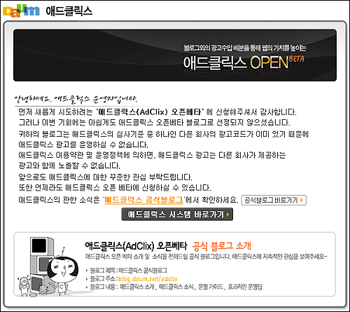

  
여러 많은 광고 프로그램들이 보통은 한 사이트에 두 개 이상의 프로그램을 동시에 진행할 수 없도록 되어 있다고 하죠. 그래도, 다음 애드클릭스에서는 그런 문구를 발견하지 못해서 신청을 해봤는데, 역시나 신청이 반려되었군요. (제 블로그에는 지금 애드센스가 달려 있으니까요.)  

<!-- truncate -->

우리나라에서 아직 야후의 광고 프로그램 (파나마)은 시작되지 않았으니 블로거들이 참여할 수 있는 CPC 프로그램은 구글의 [**애드센스**](http://www.google.com/adsense/) 아니면 다음의 [**애드클릭스**](http://adclix.daum.net), 둘 중의 하나일텐데 앞으로 블로거들이 애드클릭스를 얼마나 달까요? 애드센스를 달고 있는 블로거들이 얼마나 많이 광고 프로그램을 갈아 탈까요?  
  
디자인적인 측면에서 보자면 애드센스나 애드클릭스나 비슷한 것 같아요. 개인의 취향에 따라 달라지는 정도지 둘 다 깔끔하니까요.  
  
결국 애드클릭스의 관건은 프로그램이 얼마나 본문을 잘 분석하는지에 달려있는 듯 합니다. 본문이 잘 분석되어서 적절한 광고가 많이 나와야 광고주들이 많이 붙을테고, 그러면 많은 블로거들이 자신의 블로그에 공간을 마련할테니까요. 뭐, 순서가 바뀔 수도 있고요. 과연 토종 프로그램인 애드클릭스가 검색마왕의 프로그램 애드센스의 성능을 뛰어넘을 수 있을까요? 흥미진진합니다.
