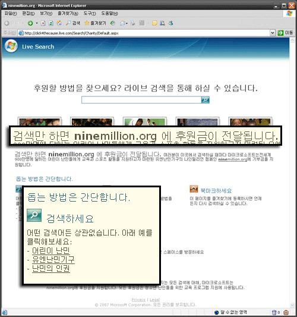

[  
**http://click4thecause.live.com/Search/Charity/**](http://click4thecause.live.com/Search/Charity/)  
검색만 하면 전세계 난민 어린이들을 돕는 [**ninemillion.org**](http://ninemillion.org)에 후원금이 전달된다고 하는데, 어떻게 후원금이 전달되는 조금은 설명이 있으면 좋겠다는 생각이 들었습니다. (참 까다로운 사용자인 건가요? ;; )  

<!-- truncate -->

쿼리 하나당 기부금 얼마 이런 식으로 되는 건지 어떤 건지, 후원금이 언제 전달되는 건지 뭐 그런 것들 말이죠. 인터넷 상의 정보란 게 정확치 않을 때가 있기도 하니까요. [MSN 메신저에 특정 문구를 삽입하면 마이크로소프트에서 기부를 해준다](http://nasurada.web-bi.net/blog/archive/20070312)는 내용의 글들도 여기저기서 많이 봤는데 실제로는 [미국에 사는 사용자들에게만 적용](http://kkhsoft.egloos.com/3206280)되는 거 였잖아요.  
  
하지만 위의 검색 페이지는 한글로도 되어 있는 걸로 보아 분명히 한국에 사는 사용자들에게도 해당되는 프로모션일 거라 추측해봅니다.  
  
어쨌든 Don't Be Evil을 외치는 구글 검색에 대항하는 마이크로소프트의 검색 프로모션의 주제가 **선행**이라니 재밌는 대결입니다. :)  
  

**관련 링크**  
  
[구백만 난민 어린이 돕기 캠페인 ninemillion.org](http://ninemillion.org/)  
[유엔 난민기구 UNHCR (한글페이지)](http://www.unhcr.or.kr/)
