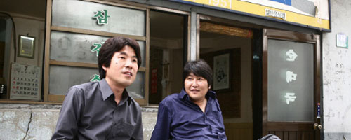
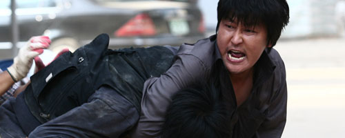

영화는 이제 한국 영화에서 너무나 보편적인 직업을 가진 조폭을 주인공으로 하고 있습니다. 게다가 그 주인공 강인구 역을 맡은 배우는 그 유명한 <넘버 3>의 송강호죠.  

<!-- truncate -->

  
인구는 꽤 성공한 것처럼 보이는 조폭입니다. 결혼도 하고 자식도 있고 - 그 중의 한 명은 유학도 보냈고… 지금 사는 집이 좀 낡긴 했으나, 뭐 곧 옮길 예정이니 상관없지요. 더욱이 같은 조폭계에 듬직한(?) 오래된 친구까지 있으니 세상 뭐 부러운 게 있을까요.  
  
… 싶지만 그는 하루하루 고된 삶을 삽니다. 하긴, 맞는 놈 만큼은 아니겠지만 때리는 놈도 힘은 들테니까요. 게다가 조폭 보다도 더 조폭 같은 공사 현장 소장도 상대해야 하고, 질서 잡힌 조폭 세계에 진짜 조폭 마인드의 다른 조폭들로부터 몸도 보전해야 하죠.  
  
  
사실 이 영화는 인구의 직업이 조폭이 아니어도 상관이 없는 영화입니다. 조폭이 아니더라도 정글의 법칙이 적용되는 우리 사회에는 이미 조폭성이 난무하고 있잖아요. 조직의 논리, 강자의 논리, 부자의 논리. 누구라도 그 안에서는 힘들게 살아가고 있잖아요. 조폭이 힘들게 살아간다고 불쌍하게 봐야 하는 건가요? 하긴, 영화는 그런 인구를 동정하지도 구원하지도 않아요.  
  
 **(이 영화는 결말의 내용이 반전과는 관계 없으나 그래도 스포일러라 생각하여 가려둡니다.)** 

(이 영화는 결말의 내용이 반전과는 관계 없으나 그래도 스포일러라 생각하여 가려둡니다.) " tt\_lesstext=" **(닫습니다.)** " tt\_id="1"> 인구가 조폭 생활을 그만두기 원했던 아내와 딸은 인구가 끝내 변하지 않는 걸 보자 매우 '현명하게도' 도망을 갑니다. 그것도 떳떳하게 말이죠 - 바로 딸이 유학을 가고 아내가 보호자로 따라가는 겁니다. 남편이, 아버지가 조폭이라 싫다고 하던 두 모녀는 여전히 조폭이 벌어다 준 돈을 생활비로 이용하면서 남편의, 아버지의 품에서 벗어나는 거지요.  
  
  
세상은 이렇게 무섭습니다. 그러나, 멍청한 인구는 그렇게 조폭인 채로 쓸쓸히 빈집에 혼자 남아 유학간 아들, 딸 그리고 아내의 비디오 영상을 틀어놓고 라면을 끓여먹다 펑펑 웁니다. 그러고도 끝까지 자기가 뭘 잘못했는지 모르겠지요..

  
그는 정말 가족을 사랑한 것일까요? 자기 자신은 행복할까요? 그게 누구를 위한 행복일까요? 오늘도 불쌍한 인구는 이유도 모른 채 혼자 남아 자기 인생도 아닌 인생을 살며 위험한 전쟁터로 출근을 하겠지요.  
  
참, 음악이 기가 막힙니다. 제가 원래 칸노 요코의 팬이기도 하지만 그녀는 이번에도 맛깔스러운 음악을 만들었더군요. 영화의 처음과 끝에 약간 코믹한 느낌의 같은 음악을 사용했는데, 영화를 다 보고 난 이후의 처음과는 묘하게 달라진 느낌을 잘 표현해주고 있습니다. 집을 보러 갈 때 나오는 음악도 역시 확실히 장면을 살려줬고요.  
  
무엇보다 음악이 절대 어느 이상 커지지 않으면서도 분위기를 유지시켜주고 있다는 것입니다. 심지어 음악이 나오는 횟수가 그리 많지도 않아요. 그럼에도 음악이 빛나는 건 감독과 음악감독의 센스라고 밖에 할 수 없겠죠. (어느 인터뷰를 보니 감독이 작업한 곡들 중에 몇 곡을 뺐다고 하더군요.)  
  
 /   
  

**별 관계는 없지만**  
  
인구가 친구인 현수 (오달수 분)와 농담도 하다가 살벌한 분위기도 되다가 하는 장면을 보다가, 그리고, 그와 비슷한 몇몇 장면들도 보다가 문득 드라마 <하얀 거탑>의 한 장면이 생각났습니다.  
  
장준혁이 암에 걸려 죽어가다가 자신을 찾아온 염동일을 보며 "그래도 얼굴은 보면서 살자"고 했던 장면 말이죠. 자기가 권력을 잡고 휘두를 때는 약자에게 죽일 놈 살릴 놈 하다가 또 자기 맘이 내키거나 상황이 바뀌면 '우리가 친구 아닌가', '그래도 잘 지내자' 라는 게 바로 권력에 기생하고 상황 논리로 죄의식을 없애는 조폭들의 특징 아닌가 싶어요. 학교 다닐 때 보던 주먹 쓰는 애들부터 정치인들까지의 공통된 특징이기도 하고요.
