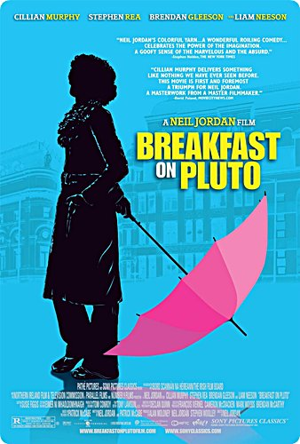

  
aka Breakfast on Pluto  

<!-- truncate -->

우선, 패트릭 '키튼' 브랜든은 '그'일까요, '그녀'일까요? 젠더 (gender)로 보자면 그는 틀림없는 여성입니다. 어렸을 때 부모로부터 버려졌고, 아일랜드 안에서 드랙 퀸의 생활을 하며 가족의 일원으로 편입되지 못하는 삶을 살았던 그녀는 분명 여러가지를 상징하는 인물이죠.  
  
심지어 그녀는 아일랜드의 정치적 현실에 대해 전혀 관심이 없습니다. 물론 영국과 아일랜드가 대치하는 현실은 그녀를 가만히 내버려두지 않지만 그렇다고 그녀도 그런 현실에 굴복하거나 도망치지 않습니다. 이 영화의 가장 큰 매력은 바로 여기에 있죠.  
  
어렸을 적 양어머니가 여자 흉내를 내는 그녀를 두들겨 패도, IRA가 그녀를 죽이려고 구덩이 속의 그녀에게 총을 들이밀어도, 영국 형사가 취조실에서 그녀를 몰아붙여도 그녀는 한번도 거짓말을 하지 않아요. (그 과정이 언제나 그녀의 선택만으로 이루어진 건 아니었지만) 그녀는 언제나 세상에 당당히 맞섬으로써 그녀의 행동이 세상 물정 모르는 대안 없이 벌이는 치기 어린 짓이라는 비판을 무력화 시키는 동시에 아일랜드의 현재 위치를 떠올리게 만드는 두 가지 역할을 훌륭하게 해내죠.  
  
러닝타임이 상당히 길면서도 밝고 유쾌하게 패트릭의 행적을 쫒는 이 영화는 <크라잉 게임>의 21세기 버전이라 할 수 있겠습니다. 현실에서 억압받는 여성 (혹은 약자)이나 정치적으로 비틀린 세상 속에서 싸우는 이들에게 (그리고 예전의 자기 자신에게도) '이런 식은 어때?' 라고 말하는 느낌이었다고나 할까요? 챕터로 연결하는 형식도 재치있었고, 패트릭 역의 킬리안 머피의 연기도 훌륭했어요.  
  
그나저나 킬리안 머피를 처음 봤을 때부터 '저 배우 참 특이하게 생겼다'는 생각과 동시에 '참 여성적인 느낌이 난다'고 생각했는데 결국 드랙 퀸 역할을 하는군요. :)  
  
 /  /   
  

**관련 링크**  
  
[필름2.0 - <플루토에서 아침을> 비하인드 스토리](http://film2.co.kr/moviedb/movie_news.asp?mkey=41305)  
[필름2.0 - 닐 조던의 즐거운 영화](http://film2.co.kr/review/review_final.asp?mkey=2451)  
[필름2.0 - 배우에게 목적지는 없다 <플루토에서 아침을> 킬리언 머피](http://film2.co.kr/feature/feature_final.asp?mkey=4364)  
[씨네21 - 여성인 척하는 남자의 이야기 <플루토에서 아침을>](http://www.cine21.com/Movies/Mov_Movie/movie_detail.php?id=18438)
