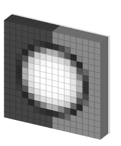
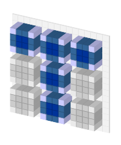

**2007.4.6.** **파비콘을 3D 도트 이미지로 만들어준다. favicon2dots**  
  

(써머즈의) 어쿠스틱 마인드  

<!-- truncate -->

  

[뼈와 살](http://bones.tistory.com)  
  
  

[태터툴즈](http://tattertools.com)  
  
  

[이올린](http://eolin.com)  
[▶ 해보러 가기](http://favicon2dots.com)

  

**2007.4.5.** **국회 "안마원" 설치 추진**  
국회 관계자는 "사회문제화된 퇴폐 안마시술소가 아닌 시각장애인 안마사들을 고용하는 건전한 안마원으로 운영할 예정"이라며 "시각장애인에 대한 사회적 이미지를 개선하는 긍정적 효과도 있을 것"이라고 강조했다. 앞으로는 날치기 한판쇼 같은 거 화끈하게 하고 사이 좋게 손 잡고 안마 받으러 가는 거야…  
  
[▶ 기사보기](http://news.media.daum.net/politics/others/200703/21/yonhap/v16132129.html?_right_TOPIC=R8)

  

**2007.4.4.** **팔골절 수술중 사망한 여중생, 부천 순천향병원 시신 강탈하여 사건 은폐 조작의혹**  
병원관계자는 “수술동의서를 받은 이상 법적인 책임이 없다”고 말하였으며, ”임양의 죽음은 의료사고가 아니라 알 수 없는 질병이거나 특이한 체질의 가능성이 포함되어 있는 상황이다”라고는 원론적인 답변을 들어야 했다. 시간이 갈수록 계속 말을 바꾸어 변명하는 사람의 말은 믿어서는 안된다. 곳곳에 <하얀거탑>들.  
  
[▶ 기사보기](http://www.peoplevoice.co.kr/news/articleView.html?idxno=1644)

  
  

**2007.4.2.** **이동진의 영화 풍경**  
조선일보를 떠난 이동진 기자, 우선은 네이버에 둥지를 틀다.  
  
[▶ 보러가기](http://news.naver.com/moviescene/)
