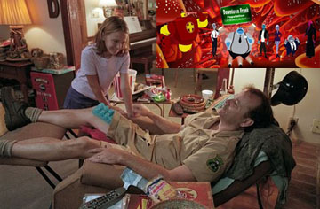

  

<!-- truncate -->

Osmosis Jones  
  
내 몸에서 세포들이 하는 말을 들으면 - 전부 다 들으면 혼란스러워서 미치겠지만 어떤 주된 소리 위주로 듣는다고만 해도 내 생활이 굉장히 많이 조심스러워질 것 같아. 이를테면 입이나 뇌 등에서는 맛난 걸 달라고 요구할테고, 다리나 팔은 움직이기 싫으니 운동하지 말라고 할테고, 허리 같은 곳은 운동 안하면 안좋아지니까 적당히 운동하라고 할테고. 뭐 그런 식으로.  
  
내 생활 중에서 이런 식으로 생각할 때 무리가 가고 있는 게 뭘까 생각하니까 너무나 많은 거야. 아유, 끔찍해. J의 말대로 두가지 욕구가 상충하는 경우에 보통은 가시적인 쾌락을 얻을 수 있는 걸 택하기 쉬우니까. 게다가 사람 심리가 닥치지 않으면 피하는 것들도 많잖아.  
  
이런류의 영화들은 대부분 그래. 잘못된 집단 속에서 우리의 주인공이 무언가 다른 방식으로 제대로된 일을 해낸다 하는 것들. 특히 헐리우드 영화 속 영웅들. 근데, 우리 몸에서 뭔가 잘못된 세포들이 생기는 경우 대부분 그게 종양이나 암이나 뭐 그런 걸로 발전하는 거 아닌가? 그렇게 배웠는데. 그래서 세포들이 알아서 죽인다고. 그렇다면 똑똑하고 잘난 것도 혼자서라면 결국 인정을 못받는다는, 뭐 그런거야?  
  
영화를 보면서 좀 더 진지하게 접근해본다면, 존재론적인 이야기나 관계에 관한 이야기로 풀어본다면 어떨까, 재밌을까.. 하는 생각이 들었어.  
  
그나저나 실사와 셀 애니메이션이 섞여서 진행되는데, 실사 부분의 Frank (Bill Murray 분), 진짜 지저분하게 나온다. 어찌 보면 주연급인데 진짜 지저분해서 등장할 때마다 속으로 진짜 너무한다, 대단하다를 연발했다니깐.  
  
평점을 주자면 별 다섯개에 세개 반. Farrelly 형제의 상상력을 표현해주는 건 좀 아쉽긴 하지만 역시 애니메이션의 힘.  
  

20030530, watched DVD

  
 /  /   
  
난 이 영화 꽤 재밌었는데, 평도 흥행도 그리 좋지 않았었다.
