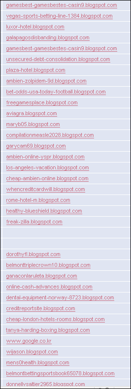

스팸 리퍼러가 극성인지는 꽤 오래 되었습니다. 각종 약 (다이어트, 발기부전 치료제 등)과 보험/대출 (insureance, loan, credit 등), 건강 (health- 등), 도박 (poker, casino 등) 관련 키워드들이 리퍼러를 쓸고 지나가곤 하지요.  

<!-- truncate -->

이게 처음에는 http://www.favorite-sport-betting.com/# 처럼 키워드가 도메인에 직접 들어있는 형태를 취하더니, 그 이후에는 http://www.미국의평범한대학사이트.edu/?s=myonlinecaribbeanpoker.com# 처럼 일반 사이트에 꼬랑지로 달려 들어오더니 드디어는 [**블로그스팟**](http://blogspot.com)에도 입성했더군요.  
  
  

여전히 한번 들어올 때 러쉬 ~~(앤 캐쉬)~~ 수준이고, 모두 실제로 접속이 되는 주소들이더군요.  
  
구글 측에서 단속을 좀 해야하지 않을까 싶습니다.
