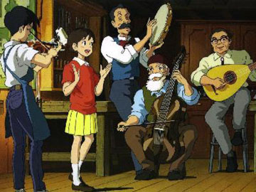

  

耳をすませば  

<!-- truncate -->

영어 제목은 Whisper of the Heart. 다른 제목으로도 알려져 있는데 Mimi O Sumaseba (If You Listen Closely). 원작은 히아라기 아오이. 작곡은 역시(?) 히사이시 조 - 미야자키 하야오가 각본 및 제작을 맡았으니.  
  
누군가에 의해 새로운 세상을 여는 경험을 하게 되는 사람들이 있어. 나 또한. 그 경험은 좋은 경험일 수도 있고, 잊고 싶은 기억일 수도 있지. 여기서는 무언가 새로운 세상에 도전하는 젊은이들의 이야기이지. 나 또한 그런 경험이 있어. 세상이 180도 달라지는 경험. 내가 몰랐던 것들, 내가 전혀 인지하지 못했던 것들을 일깨워 주는 경험 말야.  
  
희망을 가지는 것, 더 나아지는 욕구를 불러일으키는 사람들을 경험하게 돼. 그게 직접적이든, 간접적이든 말야. 사실, 그건 성장하는 거라고 생각해. 흔쾌한 경험이어도, 떠올리고 싶지 않은 경험이어도 말야. 그걸로 인해, 그 순간으로 인해 세상이 달라지는 거야, 인생이 달라지는 거야. 잊혀지지 않는 기억들이지. 너도 그런 경험이 있지 않니?  
  
내 그 시절은 어땠나 생각해보게 되었어. 나는 집을 떠나 대학교에 다녔고 지금도 또 다른 환경에서 지내고 있지만 그 당시 느꼈던 것들이 소중하다고 느껴질 때가 있어 - 유쾌한 것이든, 기억하기 싫은 것이든 간에 말야. 나는 무언가를 향해 계속 나아갔고 때론 뒹굴기도 하고 그랬지. 아, 난 지금도 그렇지.  
  
평점을 주자면 별 다섯개에 세개 반. 풋풋한 이야기, 건강한 사람들.   
  

20030609

  
 /  / 
