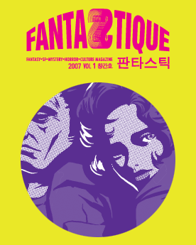

  
[**장르문학 전문지 판타스틱 (Fantastique)**](http://www.fantastique.co.kr)이 창간되었습니다.  

<!-- truncate -->

다음은 창간호 목차입니다.  
  
> SPECIAL  
> 226 특집1 17인의 영화 전문가가 말한다  
> 이런 작품 영화화하면 어떻습니까?  
> 246 특집2 판타스틱의 편견으로 뽑은 한국 역사상 최고의 상상  
>   
> FICTION  
> 34 SF 장편 연재 복거일 / 역사 속의 나그네  
> 44 호러 단편 듀나 / 너네 아빠 어딨니  
> 74 SF 단편 김창규 / 당신은 혼자가 아니에요  
> 96 미스터리 단편 미야베 미유키 / 6월은 이름뿐인 달  
> 124 SF 중편 연재 폴 윌슨 / 다이티 타운 걸  
> 154 판타지 단편 이윤하 / 이팅 하트  
> 160 판타지 장편 연재 루이스 캐롤 / 실비와 브루노  
>   
> COMICS  
> 178 유시진 / 눈의 휴식  
> 194 김태권 / 도둑 맞은 이야기  
> 216 정우열 /  
> INTERVIEW  
> 86 국내 최초 독점 인터뷰  
> 일본 미스터리의 대모, 미야베 미유키  
> 168 일본 모던 호러 소설의 기수, 기시 유스케  
> 240 SF와 만주 웨스턴에 도전한다, 김지운  
>   
> Trend  
> 12 Pickup 19금의 철퇴를 맞은 명작 만화 <<신시티>>의 속 사정부터 트렌드를 대표하는 언저리 뉴스  
> 22 Music 순도 100퍼센트 페로몬의 분출, 《바바렐라》 OST  
> 23 Game 러브크래프트의 ‘저주받은’ 디지털 자손들  
> 24 사소한 것의 역사 도시 괴담  
> 25 퓨처 러브 파트너의 기분을 함부로 알려 하지 마라  
> 26 아는 척 가이드 장르 픽션이란 무엇인가  
> ISSUE  
> 28 SF 나침반 ? SF의 범위는 어디까지인가?  
>   
> COLUMN  
> 218 김낙호의 어매이징 코믹스월드  
> 220 김봉석의 장르문화 스코프  
> 222 김창규의 TV 파노라마  
> 224 한윤아의 동아시아 장르영화 연구  
>   
> GENRE SCOPE  
> 260 영화 프리뷰  
> 262 영화 리뷰  
> 266 국내외 신간 단평  
> 268 책 리뷰  
> 272 신작 영화, 소설 리스트 업데이트  
>   
> LETTER & NOTICE  
> 8 Publisher’s Letter 발행인의 글  
> 10 Editor’s Letter 편집장의 글  
> 123 정기구독 안내  
> 159 소설, 만화 작품 투고 안내  
>   
> FANTASTIQUE READER  
> 274 이미지 임팩트  
> 275 독자 편지
