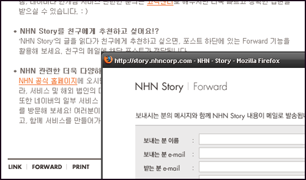

  
[블로그씨의 블로그 이야기](http://blog.naver.com/mrblog) (네이버 블로그)  

<!-- truncate -->

  
[NHN Story](http://story.nhncorp.com/story.nhn)  
사용자들의 블로그는 담기 (펌)가 기본이고, 자신들 (엄밀히 말하자면 주체가 같지는 않지만)이 사용하는 블로그에는 포워딩, 메일로 내용 알리기가 기본이다.  
  
왜 다를까… 몸집 불리기? 사용성? 유저 탓?
