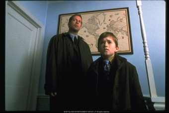

  

Sixth Sense.  

<!-- truncate -->

완전히 혼자 뒷북치는 거지. 영화 이야기가 아니라, 내가 영화를 본 시기 말야. 사람들이 이 영화 이야기를 하면 관심없는 척 하면서 딴청 부리고, 억지로 귀담아 듣지 않고, 화제를 다른 곳으로 돌리고 그랬지 뭐야. 그렇게 해서라도 이 영화를 보려고 노력한 내가 생각해보면 재밌기도 하고.  
  
지금쯤이면 내용을 말해도 스포일러라는 이야기는 듣지 않겠지? Malcolm 박사 (Bruce Willis 분)는 얼마나 놀랐을까. 물론 Cole (Haley Joel Osment 분)도 마찬가지겠지만 말야. 스스로 굳게 믿고 있던 사실이 무너지는 기분... 생각하니 참 씁쓸해.  
  
천연덕스럽게 이야기를 짜서 진행시키는 감독이 참 대단해 보였어. 유심히 보니, Malcolm 박사가 나오는 씬은 거의 혼자 아니면 Cole하고만 나오더라구. 다른 사람하고는 이야기도 안하고... 그렇게 조각조각을 마치 전체인 것 같은 분위기로 보여준 거지.  
  
평점을 주자면 별 다섯개에 네개. 늦게 봤지만 재밌더라.  
  

20020904

  
 /  /   
  
  
  

반전영화의 대명사가 되어버렸지만, 이 영화에서 보여주는 사람들 간의 관계, 특히 가족들간의 이야기는 참 매력적이다. 특히 다음 장면은 내가 제일 좋아하는 장면 중의 하나.
