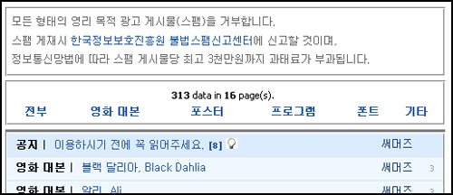
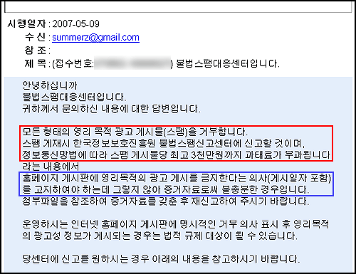

제 블로그에는 스팸 댓글이나 스팸 트랙백이 거의 달리지 않지만 영화 대본 자료실에는 종종 스팸 게시물이 달려서 아래와 같이 메시지를 적었습니다. 웹서핑 하다가 안 건데, 저렇게 눈에 띄이는 곳에 공지해놓지 않으면 효력이 없다나요?  

<!-- truncate -->

  
그 이후에도 스팸 게시물이 올라왔길래 캡쳐하고 삭제한 후 주저없이 [**불법스팸대응센터 SpamCop**](http://www.spamcop.or.kr/)에 신고를 했습니다. (외국 회사들이 적은 스팸은 신고해도 별 효력이 없을 것 같고 해서 그냥 지우기만 했고요.)  
  
그리고 얼마 후 답변 메일을 받았는데 예상 밖이어서 놀랐습니다. -o-  
  
  
보시다시피 제가 적은 글에 게시물을 금지한다는 의사가 충분하지 못했다는 문장이었어요. 아니, 원치도 않은 저런 내용을 스팸 때문에 어쩔 수 없이 대문짝만하게 박아놨는데 저것도 불충분하다니!  
  
답변 내용이 단순히 copy & paste 한 것 같은데요, 멍해진 머리를 진정시키고 잠시 들여다본 후 내린 결론은 **(게시일자 포함)** 이라는 문구였습니다. 스팸을 받은 후에 저 글을 적어놓을 수 있다- 뭐 그런 취지에서 표기해야만 한다는 거겠죠?  
  
하지만 제 추측일 뿐이죠. 궁금한 마음에 '저것도 부족하다니, 가이드라인을 알려달라'는 메일을 보냈습니다. 만족할 만한 답변을 받게 되길 기대하는 중입니다;;;
