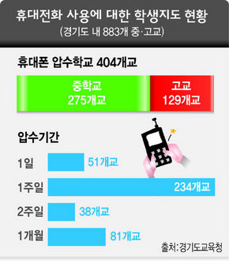

**2007.5.13.** **포털업계 "마이SQL 정리할까"**  
마이SQL은 공개소프트웨어로 서비스가 포함된 유료버전도 상용 DBMS의 10분의 1가격인데다 DB트랜잭션 기능이 약하기는 해도 이노DB를 사용하면 상용 DB 못지 않은 성능을 발휘해 사실상 인터넷 포털업계를 평정한 DB다. / 그러나 이노DB의 소유권이 오라클로 넘어가게 됨에 따라 마이SQL 사용에 대한 최대 복병으로 떠오르고 있는 것이다. 싸이월드도 mySQL, 다음도, 구글도 mySQL. 네이버의 NHN은 자체 DB 개발을 시작했다고 한다. 정말 오라클의 향후 행보가 기대된다. 그나저나 마이SQL이라고 적으니 되게 웃기네-  

<!-- truncate -->

[▶ 기사보기](http://www.dt.co.kr/contents.html?article_no=2007051102010860704003)

  

**2007.5.12.**  **지하철 무료신문 "폐지수집" 못한다**  
실제 공사가 지난달 질서기동팀을 투입해 '무가지 수거자 집중단속'을 펼친 결과, 1~4호선에서 수거활동을 하는 사람만 191명에 달했다. / 수거자 대부분은 60~80대 노인들로, 하루 수t씩 쏟아지는 무가지를 1인당 50~60kg 정도씩 수거해 kg당 70원에 판매, '용돈벌이'로 활용하고 있었다. 수도권 전철을 처음 탔을 때 신기해 하며 봤던 광경. 처음엔 각 신문사에서 계속 신문을 사보게 하려는 목적에서 거둬가는 줄 알았다. -\_-)  
  
[▶ 기사보기](http://www.newsis.com/newsis/Index?title=&pageTp=Sub4&pId=&cId=&artiGbn=ARTI&artiId=NISX20070425_0002647439)

  

**2007.5.9.** (**신한은행의) "노피싱" 프로그램 일부 문제 발생**  
신한은행이 안전한 인터넷 뱅킹을 제공하기 위해 지난 달 13일부터 무료 배포하고 있는 '노피싱(no phishing)' 프로그램에 일부 문제가 발생하면서 불편을 초래하고 있다. A씨 경우처럼 인터넷 창이 닫혀버리는 피해가 발생하고 있는 것이다. / 또 한번 설치한 뒤에도 신한은행 사이트에 접속할 때면 똑같은 프로그램이 반복 설치되는 경우도 있는 것으로 알려졌다. 신한은행 콜센터에는 이 문제와 관련한 불만 전화가 하루 평균 20건 가량 접수되고 있는 것으로 확인됐다. 인터넷 뱅킹 하려고 들어가면 (액티브엑스를 통해) 설치되는 프로그램만 대여섯 가지이다. 뒤집어 놓고 생각해보자. MS 윈도가 중요 거래를 위해서는 이렇게 대여섯 개씩 프로그램을 설치해야할 정도로 평상시엔 보안에 취약한 OS인 건가? 그럼 평상시엔 어쩌라고… 그냥 허술한 보안 참고 사용하란 건가? 아뭏튼 MS 왕국 만세!  
  
[▶ 기사보기](http://www.inews24.com/php/news_view.php?g_serial=260903&g_menu=020200)

  

**2007.5.7.** **우리 아이들 ‘휴대폰 등교’ 어찌할까요?**  
  
  

출처 : 한겨레신문  
국가인권위원회는 지난 2월 수원 청명고에서 교사가 학생의 휴대전화를 강제로 압수하고 휴대전화 문자메시지를 임의로 들여다본 행위에 대해 “헌법 제7조 사생활의 비밀과 자유 및 18조 통신의 자유를 침해한 사항”이라며 주의 조처를 내렸다. / 경기도 교육위원회 이재삼 위원은 “임의적인 압수보다는 학생과 학부모와의 소통을 통해 합리적 대안을 마련하는 것이 우선돼야 한다”고 지적했다. 내가 보수적인 걸까? 수업시간에 핸드폰을 꺼내는 게 이해가 안간다. 무슨 핸드폰을 압수하는 게 헌법적 권리를 침해하는 거라는 인권 운동가의 말도 완전 오버센스고. 그나저나 아무리 얘기해도 말을 듣지 않는 요즘 현실을 볼 때 댓글에 있는 **"각 교실에 휴대폰 방해(차단)기를 설치하면 되지 않을까요?"** 가 가장 현실적인 대안이 아닐까 싶다.  
  
[▶ 기사보기](http://www.hani.co.kr/arti/society/society_general/205769.html)
