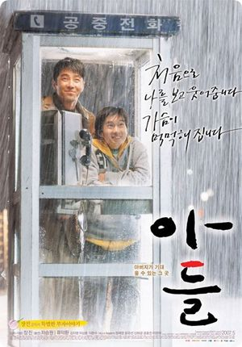

  

15년째 복역 중인 무기수가 딱 하루의 외출을 허락 받아. 아들의 얼굴을 보기 위해서지. 아버지는 아들에게 부끄러운 마음이 가득하지만 그래도 이것저것 이야기를 붙이고, 어렸을 때 아버지와 헤어진 채 15년 동안 살아온 아들은 생면부지의 아저씨 같은 아버지를 좋은 감정으로 대하지 않아.  

<!-- truncate -->

하지만, 피는 진하다고 이 둘은 하룻밤 사이에 금방 친해지고 어느덧 서로 할말 못할 말 다 하는 사이가 되지. 무기수와 함께 나온 교도관의 소리없는 지원의 힘도 크고 말야.  
  
그런데, 이야기는 이렇게 순탄하게만 진행되지 않아. 아주 결정적인 반전을 가지고 있지. 이건, 뭐- 거의 <유주얼 서스펙트>, <식스 센스> 수준의 반전이야. 그런데, 반전이 있는지 모르고 봤다면 어땠을지 모르겠지만 그걸 인지하고 봐서 그런지 영화가 너무 심심한 거야. 결국 하고자 하는 이야기가 뭔지도 잘 모르겠고.  
  
그리고, 아버지와 아들의 독백은 효과적이면서도 영화라는 매체가 가진 매력을 깎아먹는 느낌도 들었어. 장진 감독은 항상 "연극과는 다른, 영화에서만 볼 수 있는 걸 보여주겠다"고 하지만, 그가 만드는 작품들은 영화 보다는 연극에 더 어울리는 것 같아.  
  
그나저나 현재의 상황이 옳다 그르다를 떠나서 이 작은 영화가 이렇게까지 크게(?) 개봉할 수 있는 건 솔직히 배급사의 힘인 것 같아. 즉, 외국 영화로부터 한국 영화를 보호하는 스크린쿼터는 반쪽짜리 쿼터임을 증명하는 거지. 스크린쿼터가 영화인들이 말하는 것처럼 "문화의 다양성을 지키는" 목적에 더 가깝게 가려면 한국 영화, 외국 영화 관계없이 최대 개봉관 개수를 제한하거나 작은 영화에 대한 보호책을 세우거나 특정 소재나 주제에 관련된 영화에 대한 지원책을 마련하는 등 '문화'에 대해 더 초점이 맞춰져야 하는 게 아닐까 싶어.  
  
평점을 주자면 별 다섯개에 두 개 반. 그런데, 류덕환이라는 배우는 아무리 봐도 리틀 조승우야. 느낌이 비슷해. 그리고, 여성스러운 면도 있고.  
  
 / 
