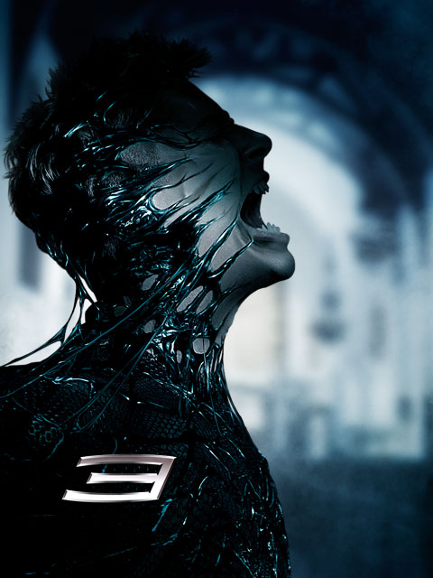

  

Spider-Man 3  

<!-- truncate -->

**1**  
  
어느 영화 잡지인지 영화 블로그인지에서 스파이더맨을 "심비오트 수트를 입고 복수심에 불타고 악에 물들었으면서 기껏 한다는 악행이 머리카락 내리고 엉성한 춤이나 추며 여자친구 때리는 게 고작인 찌질이"라고 하는 글을 봤다. 정말!  
  
**2**  
  
하지만 그보다 더 찌질한 짓은 세상에 둘도 없는 친구인 해리의 얼굴에 짙은 화상을 입혀놓고는 자기가 필요할 때는 도와달라고 부탁했던 거나, 법의 대리인도 아닌 주제에 자기 맘대로 샌드맨을 용서해 준 게 아닐까? (네가 뭐길래! - 물론 3편의 주제가 '용서'라는 건 알겠다. 하지만 아는 것과 느끼는 건 다르다.)  
  
**3**  
  
솔직히 스파이더맨이 슬쩍 미국 국기를 지나가는 장면에서는 여기저기에서 관객들이 피식(내지는 우하하-) 대는 소리가 들렸다. 하지만, 이런 즉각적인 반응은 조건반사에서 나오는 것인지도 모른다. "미국의 영웅주의"라며 애둘러 비아냥 거릴 수 있는 좋은 기회이기도 하고.  
  
그런데, 이 영화의 제작사는 일본계 기업인 소니 픽쳐스이고, 샘 레이미는 기존의 고정관념을 흔드는 영화를 만들어 온 B급 영화 감독이었고, 생계조달형 히어로 피터 파커 역의 토비 맥과이어 역시 그의 필모그라피를 보면 영웅과는 거리가 먼 배우이다. 그런데, 그 생뚱맞은 장면은 어떻게 나온 걸까?  
  
**4**  
  
1편과 2편은 재밌었는데 이번 3편은 솔직히 좀 별로였다. (신나게 때려부수는 액션 활극 블록버스터로 보자면 별 부족함이 없지만) 그냥 가볍게 가볍게, 하긴, 이 시리즈가 피터 파커의 성장통을 담은 성장 드라마라는 관점에서 보자면 더 무거워도 부자연스러울 것 같기도 하다.  
  
**5**  
  
일주일만에 사상 최대의 금액이 들어간 제작비를 고스란히 회수했다고 하고, 4편도 제작이 결정되었다고 한다. 궁금하다. 어찌되었건 이야기를 어느 정도 마무리 지은 스파이더맨 시리즈는 이제부터 시작일지도 모른다. 내 오직 바람은 반전 영웅에서 이데올로기의 선전 영웅이 되어버린 람보 시리즈처럼 몰락하지 않기를 기대할 뿐.  
  
**+**  
  
디지털관에서 봤는데 - 예전부터 느낀 거지만 - 화면이 정말 "쨍-"하더라. 현실적으로 몇몇 기술적인 문제가 걸려서 디지털 상영이 제한적이라고 하는데, 솔직히 이 정도의 화질 차이라면 전 상영관이 디지털관으로 바뀌는 건 순식간일 것 같다. 적어도 CG가 듬뿍 입혀진 블록버스터를 좋아하는 멀티플랙스의 경우엔 그럴 듯 싶다.  
  
 /  / 
