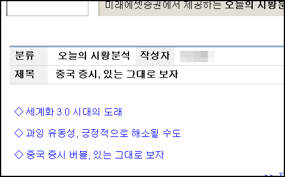

  
미래에셋에서 온 메일인데요, 세계화에도 버전이라는 게 있더군요.  

<!-- truncate -->

세계화 1.0 시대 (1492 ~ 1800년)에는 국가 주도의 성장, 세계화 2.0 시대 (1800 ~ 2000년)에는 기업 주도의 성장, 세계화 3.0 시대 (2000 ~ 현재)에는 개인 (소규모 기업)이 성장의 주체이자 동력이라고 한답니다.  
  
몰랐어요. 세계화도 이렇게 버전으로 말하는지;;;  
  
  
p.s. [아거님의 글](http://gatorlog.com/?p=49)을 보긴 했지만 글만 읽고 책은 안봤거든요. -o-
