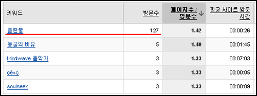

예전에 구글이 우리나라에서도 검색 결과를 수정 (원천적으로 필터링)한다는 글을 작성한 적이 있다.  

<!-- truncate -->

**어쿠스틱 마인드 - 구글과 음란물. 구글과 음란물?**  
  
이 글이 작성되고 난 후 구글에서 **'음란물'**이라는 키워드로 [**검색**](http://www.google.co.kr/search?hl=ko&q=%EC%9D%8C%EB%9E%80%EB%AC%BC&lr=)을 하면 항상 검색 결과 첫페이지의 첫번째 혹은 두번째로 표시가 되었는데, 어쩌어찌 하다가 오늘 확인해보니 검색결과에 쏘옥 빠져있다.  
  
리스트에서 순서가 좀 밀린다거나 한 두 페이지 뒤로 가는 것 정도야 그런가보다 할 수 있는데, 하루 아침에 검색 결과에서 완전히 사라져버리다니… 구글 코리아도 모니터링 및 검색 결과를 수정한다고 짐작할 수 밖에 없다.   
  
저 방문수가 모두 구글 쪽에서 들어온 건데.   
(예전에 검색되어 나왔을 때의 페이지를 캡쳐해놓을 걸. 그럼 확실한데; 아쉽다.)  
중국처럼 국가기관이 요청한 경우에 삭제를 하거나 필터링을 하는 것은 로컬라이징 과정에서 충분히 그럴 수'도' 있다고 생각하지만, 이번 경우는 어떻게 봐야 할지 생각을 해봐야 할 것 같다. 자사 이미지에 좋지 않은 영향을 주는 검색 결과의 필터링인가? (구글에서 음란물 검색이 가능하다는 걸 알려주는 글이니까)  
  
  
추가)  
  
다음날 다시 보니 원래대로 (검색 결과 첫 페이지의 첫번째 글로) 복구가 되어 있다. 특정 사이트만 검색 결과에서 빠졌다가 들어갔다 할 수 있는 것일까? 신기한 노릇.
