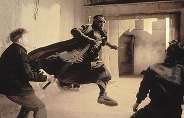

  
Blade II  

<!-- truncate -->

그러고 보면, Blade 1편은 The Matrix 보다 먼저 개봉했잖아. Blade 를 처음 봤을 때 카메라 워킹이 꼭 CF 같다는 느낌과 완전 홍콩영화식 혹은 일본만화식 액션이네 했었지. 비슷한 시기의 The Matrix는 비슷한 형태에 조금 더 나아간거고. 그러고 보면 새로운 많은 것들은 아주 혁신적인 출현이라기 보다는 조금씩 추가해나가는 과정으로서의 결과일 것이라는 생각도 들어. 어쨌든, 2편에서는 그게 더욱 강하게 - 액션신에서의 홍콩영화의 느낌이 느껴졌는데, 알고보니 견자단이 무술감독을 했더라구. 그리고 The Matrix의 영향도 약간은 있었겠지 ?  
  
그냥 아무 생각없이 액션 장면을 보다보니 영화가 끝나더라구. 좀 지루할까 싶었는데, 영화 초반부에 흡혈귀들 잡을 때의 특수효과가 애니메이션 같다는 생각을 하면서 보다보니 그냥 쭈욱 봐지더라구. 뭐랄까, Alien 시리즈와 Predator, Die Hard 시리즈 등에서 보아 온 이미지들이 많아서 익숙하다는 느낌.  
  
Wesley Snipes는 액션 배우로 유명하지. 사실은 액션 영화가 아닌 영화에도 종종 나왔는데도 사람들의 인식이 굳어져버린 것 같아. 예전에 내가 가졌던 느낌은 이런 쪽이었는데, 이 영화를 보고 나서는 그가 Blade 역할에 대해 매우 맘에 들어하는 듯한 느낌이었어. 뭐랄까 그렇게 폼 잡는 역할을 하고 싶었는데, 관객들도 좋아하니까 매우 흥에 겨워하는 듯한 느낌이랄까. 물론 그냥 개인적인 상상일 뿐이지만.  
  
평점을 주자면 별 다섯개에 두개. 3편 또 나올 듯한 분위기로 끝나네.  
  

20030705 with Airis76

  
 /  /   
  
p.s. 영화가 개봉된지 한참을 지나 떠올려보면,  
  
감독은 <판의 미로>의 기예르모 델 토로, 무술감독은 [견자단](http://www.cine21.com/Movies/Mov_Person/person_info.php?id=3035), 시나리오는 <다크 시티>, <배트맨 비긴즈>, <매그니토>의 [데이빗 S. 고이어](http://www.cine21.com/Movies/Mov_Person/person_info.php?id=7963)이다. 화려하다 화려해.  
  
당시에도 보면서 액션신이 좀 다르다 싶었는데 무술감독이 견자단이었다는 걸 알고는 대단하다- 싶었던 기억이 난다.  
  

**관련 링크**  
  
[Global MartialArts Network - 견자단의 무술세계 (1)](http://www.taekwon.net/english/webzine/wznews.asp?news_no=794)  
[Global MartialArts Network - 견자단의 무술세계 (2)](http://www.taekwon.net/english/webzine/wznews.asp?news_no=804)  
  
[듀나 - 블레이드 2](http://djuna.cine21.com/movies/blade_ii.html)
