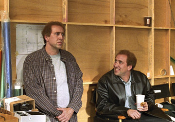

  

사람들은 여러가지 모습을 가지고 있어. 어떤 사람들은 한가지 측면이 강하고, 어떤 사람들은 여러가지 측면을 동시에 가지고 있지. 여러가지 모습들이 혼재되어 있을 때 스스로 혼란스러워하고 사람들에도 혼란을 주지만, 사실 알고보면 비슷한 측면이 있어. 뭐랄까, 한 사람에게서 나온 일관된 무언가가.  

<!-- truncate -->

내 예전 모습들을 한참동안 부정한 적이 있었어. 그 시절은 떠올리기도 싫고, 내가 도대체 어떤 정신으로 살았는지 기억도 나지 않고, 과연 내가 있었나 싶었을 때도 있으니. 그런데, 부정하면 그게 내가 아닌가?  
  
싫은 시간을 굳이 뭐하러 기억하냐고 생각할 수도 있지만, 내가 노력해서 생각하지 않더라도 살면서 비슷한 상황, 떠올리게 하는 사람들이 너무 많아. 내 자신에게서 특정 부분을 인위적으로 떠올리지 않고 생각하다보면 부작용이 일어나지. 과민반응을 보인다거나 사실을 왜곡하거나 현재를 제대로 보지 못하거나 하는 등의. 난 정말 숨지않고 있는 그대로의 내 모습을 내 예전 모습을 인정할 수 있는가?  
  
찰리 카우프만 (Charlie Kaufman), 이렇게 나가다가 나중에 어떻게 감당할려고, 하는 느낌마저 들 정도였어. 재치도, 순발력도, 스스로를 깨는 깊이도 맘에 들었어. 결국 이건 찰리 카우프만의 영화가 되어버리는 건가? 시나리오 작가가 영화를 훔치다니!  
  
사실 보면서 참 많은 생각을 하게 되었어. 수잔 올린 (메릴 스트립 분)의 입체적인 성격 - 참 묘한 매력과 연민이 느껴지는 캐릭터야. 카우프만 형제 (니콜라스 케이지 분)는 사실 니콜라스 케이지 때문에 별로였어. 예전엔 그를 좋아했었는데, 왜 내 느낌엔 어떤 역할을 맡아도 비슷하게 느껴지지? 그리고, 존 라로체 (크리스 쿠퍼 분), 그 앞에 향 좋은 촛불 하나 켜주고 싶었어. 인물들의 성격도, 그들이 만들어 내는 사건들도, 나를 많이 생각하게 했어.  
  
Adaptation, adaptation, adaptation... 참 씁쓸한 느낌이 드는 단어야.  
  
평점을 주자면 별 다섯개에 네개. 아주 현실적이면서도 매우 판타지적인 이야기.  
  

20030505

  
 /  / 
