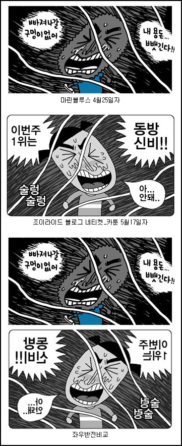

**2007.5.25.** **제2회 SICAF 국제디지털만화 공모전 수상작 발표**  
다음(Daum)과 함께하는 SICAF 국제디지털만화 공모전 수상작들. 아무래도 인기투표 같은 형식이기 때문인 걸까? 웹툰 형식의 국내 작품들이 싹쓸이 했다. 그나저나 올해는 SICAF 하는 줄도 모르고 그냥 지나갔네;  

<!-- truncate -->

[▶ 가서보기](http://cartoon.media.daum.net/event/sicaf_2007/)

  

**2007.5.25.** **70억원짜리 길거리 연주… 아무도 몰랐다**  
눈치 빠른 독자라면 이쯤 되면 어디서 읽어본 듯한 내용이라고 생각할지 모르겠다. 사실 이번 깜짝 연주회의 아이디어를 제공한 것은 워싱턴포스트 선데이 매거진의 4월 8일자 커버 스토리. 미국이 낳은 세계적인 바이올리니스트 조슈아 벨(39)이 1월 12일 워싱턴 랑팡 지하철 역에서 출근길 시민들 앞에서 ‘거리의 악사’로 변장해 45분간 32달러를 벌었다는 기사다. 조인스 닷컴이 국내 언론으로는 처음 보도한 이 기사는 4월 15일 서울 신사동 소망교회 대예배 설교시간에 김지철 담임목사가 예화로 인용할 정도로 화제를 모았다. 그후 런던 워털루 역에서도 바이올리니스트 타스민 리틀이 비슷한 실험을 했다. 1000명의 행인 가운데 8명이 발걸음을 멈췄고 리틀은 14파운드 10실링(약 2만 5000원)을 벌었다. (중략) 이날 피씨가 번 돈은 1만 6900원. 바이올린 케이스에 돈을 넣고 간 사람은 21명 가운데 14명이 1000원짜리 지폐를 꺼냈고 4명이 500원짜리 동전을 한 개씩 던졌다. 나머지 3명은 300원씩 냈다. 걸음걸이가 느리다보니 음악을 비교적 오래 들을 수 있었기 때문일까. 아니면 지하철 무료 탑승도 고마운데 뜻밖의 음악선물까지 받았기 때문일까. 아니면 수염도 못깎고 초라한 행색의 지하철 악사가 불쌍해보였을까. 70대 노인 3명이 1000원짜리 지폐를 놓고 갔다. 이들이야말로 평소 거동이 불편해 음악회 관람은 꿈도 못 꾸는 사람들 아닌가. 지하철의 거리 악사는 남녀노소, 빈부귀천을 막론하고 모든 사람들에게 골고루 음악의 혜택을 나눠주는 ‘음악 민주화’를 실천하고 있는 것이다. 여러 모임에서 CD가 좋냐, LP가 좋냐 하며 따지지만 막상 블라인드 테스트를 하면 구분을 못하는 경우가 상당한 것과 같은 것일 게다. 결국 티켓값이 그 연주의 값어치를 의미하는 것이다. 그러니 갤러리아 백화점 같은데서 '명품'의 가격이 천정부지로 올라가는 거겠지. 그나저나 **"적어도 중앙일보 기자라면 70억짜리 악기랑 70억짜리 연주는 구분해야할듯."**이라는 댓글이 일품.  
  
[▶ 기사보기](http://article.joins.com/article/article.asp?total_id=2718441&ctg=1200)

  

**2007.5.25.** **지마켓(Gmarket) 이벤트 당첨자 조작 소식**  
지마켓 회원으로 가입하기 위해서는 아이디가 6자리 이상이 되어야만 합니다. / 허나 노트북 당첨자 ak349 는 아이디가 5자리입니다. / 당연히 회원가입이 불가능하단 소리입니다. 하지만 이미 회원으로 가입되어 있다고 나오죠. 사실 상당히 많은 업체에서 자행하는 공공연한 비밀이다. 경품 아는 사람에게 밀어주기, 고가의 이벤트 상품 내부에서 나눠먹기. 그렇다고 지마켓이 잘못한 게 없다는 건 아니다. 자고로 무식하면 용감한 법이다.  
  
[▶ 보러가기](http://www.mediamob.co.kr/HeadLineView.aspx?ID=39642)

  

**2007.5.23.** **[홍대앞] 박경림이 개업한 식당 - 밥톨's**  
최근에 생긴 프랜차이즈 밥집 [밥톨's]. / 특히 홍대점 점장이 박경림이어서 유명하지요. / 수많은 연예인들이 찾아와서 화제가 된 업소입니다. (중략) 근데 이집은 마치 자신들이 컨셉을 갖고 / 직접 디자인한 것 처럼 마구 선전해 놓은 뻔뻔함이 괴씸해서 / 고민끝에 이렇게 올립니다....에구 조이라이드로 유명한 윤서인님이 발견한 디자인 표절 사례.  
  
[▶ 보러가기](http://kr.blog.yahoo.com/siyoon00/1372847)  
  
  

누군가 이 글을 보고 '윤서인님도 마린 블루스 같다 베끼면서 뭘 그러냐-'는 글을 올렸다. (사실 마린 블루스도 패러디 한 거지만) 그렇다면 '내가 하면 패러디, 남이 하면 표절'이라고 봐야 하나? 이건 물타기도 아니고 물타기가 아닌 것도 아녀~

  

**2007.5.21.** **Buy Me a Beer**  
파워 블로그라면 애드센스등 광고 상품을 링크 걸고 BM 모델로 활용을 한다..그만큼 자기 블로그에 오는 트래픽을 바탕으로 광고 수익을 가져가게 되는데 이런 트래픽 방식이 아닌 진정한 커뮤니티 형태의 기부(donation) 혹은 후원 형식의 블로그 수익원이 있다.. 이것이 진정한 블로그 수익원인지는 모르겠지만 그만큼 해당 블로거의 글을 잘 보고 있다라는 감사의 혹은 격려의 메세지를 담을 수 있어서 의미있는 시도인 것 같다..직관적으로 Give me a money 라기 보다는 Buy me a beer라는 표현이 귀엽지 않은가? 정말 깜찍합니다. 솔직하기도 하고요. 우리나라처럼 개인에 집중하는 커뮤니티라면 충분히 괜찮은 아이템이 아닐까 싶기도 하고 예의를 중시하니 대놓고 이런 부탁을 안할 것 같기도 하고. ^^  
  
[▶ 보러가기](http://sting.egloos.com/1570796)
