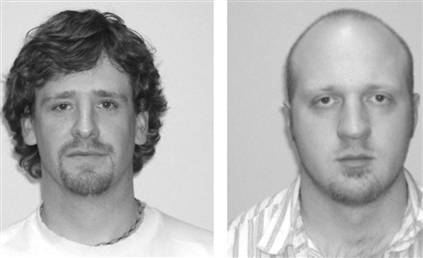

만약 필교가 혜성처럼 생겼다면 우리는 그를 기억하지 못할 것입니다. 무슨 말이냐 하면 어떤 사람에 대해 기억할 때, 시각적인 이미지와 우리가 이름 속에서 가지고 있는 편견이 일치해야 그 사람을 오래 기억을 한다는 뜻이죠. 특정 얼굴에 어울리는 이름들이 있다는 거죠.  

<!-- truncate -->

MSNBC.com에서 이런 글을 봤어요.  
  
[**만약 밥이 팀처럼 생겼다면 당신은 그를 기억하지 못할 것이다.**  
(If Bob looks like Tim, you won't remember him.)](http://www.msnbc.msn.com/id/18805010/from/ET/)  
  
사람들은 밥이라는 이름은 팀이라는 이름보다 둥근 얼굴에 더 잘 어울린다고 생각한대요. 여러분도 그렇나요? 하긴 그러니까 연예인들이 예명을 만들어 활동하는 거겠죠?  
  
[  
둘 중의 한 명이 밥이고 다른 한명이 팀이라면 누가 밥이고 누가 팀일까요?](http://www.msnbc.msn.com/id/18805733/)  
마이애미 대학교의 인지과학자인 로빈 토머스는 그녀가 특정 사람들의 이름을 햇갈려 한다는 걸 깨닫게 되었고 학생들을 대상으로 테스트를 한 결과 특정 이름에 어울리는 얼굴 형태가 있다는 걸 알게 되었다는군요. 그녀의 자세한 실험 결과는 Psychonomic Bulletin & Review 라는 저널에 실릴 예정이라고 합니다.  
  
그녀의 다음 계획은 왜 이런 스테레오타입이 존재하는지에 대한 걸 알아내는 거라고 합니다. 저는 다음 주제가 더 궁금하네요. ^^  
  
자, 그럼 위의 사진 중 누가 팀 (Tim)이고 누가 밥 (Bob)인 것 같나요?  
위의 사진을 클릭하면 다른 사람들의 생각을 알 수 있습니다.  
  
 **그들의 실제 이름은…** 

왼쪽이 브렌든 (Brendon), 오른쪽이 짐 (Jim)이라고 하는군요. :)
