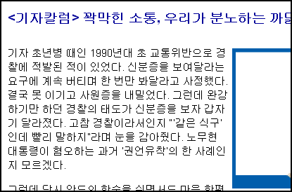

[  
해럴드경제 - <기자칼럼> 꽉막힌 소통, 우리가 분노하는 까닭은…](http://www.heraldbiz.com/SITE/data/html_dir/2007/05/23/200705230210.asp)  
1970년대도 아니고, 1980년대도 아니고, 고작 1990년대에  
기자라는 사람이, 그것도 사회초년생이  
교통위반으로 적발되었으면 순순히 신분증을 보여줄 것이지 안준다고 버티다가  
못 이기고 내 준 게 주민등록증도 아니고 면허증도 아닌 사원증이라니…  
게다가 그걸 기자실 폐쇄에 대한 불만의 글로 적어내는 모양새라니…  

<!-- truncate -->

결국 스스로 선배 기자들과 자신들을 욕먹이는 짓을 고백함으로써  
저 집단은 역시나 과거부터 권력의 등에 달라붙어 위세를 부린  
초법적 집단의 후예들이구나 하는 생각을 갖게 만든다.  
  
TV와 신문이 서로의 영향력 증가를 위해 서로 물어뜯고 싸우던 게 엊그제였는데,  
어느새 자신들의 이익을 위해 똘똘 뭉쳐있는 걸 보면  
역시 국민이란 이름을 남발하는 사람들/집단치고  
국민을 볼모 이상으로 여기지 않는다는 걸 느끼게 된다.  
  
그나저나, 과거의 저 무지막지한 행동을 용감하게 고백할 정도로 분노한 것 같은데  
글을 끝까지 다 읽어봐도 하고 싶은 말의 요지가 뭔지 잘 모르겠다.  
(그런데, 이미 기자들은 국민들과 불통 不通 하고 있지 않은가?)  
  
저 기사 뿐만이 아니다.  
요즘 저런 식의 말도 안되는 '기자실 폐쇄' 관련 기사들이 사방에 널렸다.
