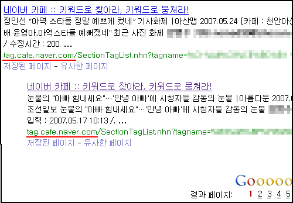

  

'어? 네이버의 카페 페이지가 구글에서 잡히네' 하고 봤더니 카페의 태그 검색 결과 페이지더군요. 역시;;;  

<!-- truncate -->

지금 대충 보니 구글을 비롯한 외부 검색에 잡히는 페이지는 카페의 태그 검색 결과, 북마크, 블링크, 마이홈 정도인 듯 합니다. (예전에 네이버의 도메인별로 robots.txt 파일 정리해 둔 게 있었는데 어디다 뒀는지 모르겠습니다 -\_- 나중에 다시 한번 정리해야겠군요.)
