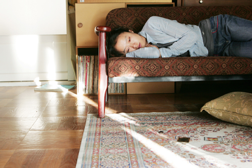

  

Secret Sunshine  

<!-- truncate -->

난 말야 영화를 보다가 문득 전도연이 갑자기 종교에 귀의하는 게 '인지부조화' 현상이라고 생각했어. 너무나 커다란 충격과 상처를 견디다 못해 스스로 납득시키는 거지. 애꿎은 종교에 귀의하는 거야. 그렇지 않고서는 견딜수가 없었겠지. 게다가 주변에 하나님 아버지를 줄기차게 찾는 사람들도 있으니까 딱이었을 거야. 그런데 말야 사람들은 왜 교회 (성당, 법당, 교당)를 다닐까? 따지고 보면 우리 모두 스스로를 납득시키기 위해 종교를 갖는 게 아닐까?  
  
적어도 영화 속에서 전도연은 종교 안에서 아무런 실마리도 구하지 못했어. 종교 안에 누구도 악한 사람은 없었고, 정말 다들 전도연을 아껴주는 마음을 가진 사람들이었는데도 아무도 그를 이해하려 들지 않았잖아. 자기가 이해할 수 있는 정도만 혹은 입으로만 '불쌍한 우리 자매님', '함께 기도해요-' 이런 말이나 하고 있지. 그런데 말야, 정말 현실도 그런 것 같아. 종교도 그렇고, 사회도 그렇고.  
  
어느 수준이 되어야 구원도 받고 함께 즐거움도 나눌 수 있는 게 오늘날의 종교, 오늘날의 사회잖아. 심지어 이미 '조직화' 되어버린 오늘날의 종교는 그 종교의 규칙을 지켜야만 보호해주고 이해해 주잖아. 배가 고파서 거칠게 날뛰는 개에게 먹이를 주는 방법은 무슨 수를 쓰든지 간에 개를 일단 얌전히 시키고 그 다음에 먹이를 주는 것처럼. 아무리 절실하고 힘들어도 베푸는 쪽의 규율을 지키고 그들의 은혜를 안다고 표현해야만 얻을 수 있는 것처럼.  
  
\*  
  
언젠가 '우리는 과연 소통하고 있는 것인가' 하는 생각을 해본 적이 있어. '거의 그렇지 않지만 가능성은 있지 않을까'하고 생각을 마무리 지었었고 말야. 우리는 상대방의 눈을 보고 이야기하지만, 모두 알아듣는 단어를 사용해 말을 하는 것 같지만 실제로 대부분의 경우는 이해하지는 못하는 것 같아. 서로 자기가 하고 싶은 말만 할 뿐이지.  
  
영화는 나에게 같은 식으로 물었어. '사람이 사람을 이해한다는 게 가능한 일일까?' 그리고는 마치 '그런 건 불가능해'라고 시종일관 보여준 다음에 영화가 끝나기 바로 전에 '혹시 몰라, 희박하지만 가능성이 있는 것도 같아'라고 말하는 것 같았어. 우리는 그 실낱 같은 희망을 품에 안고 살아가는 것일테고.  
  
내용이 원작 (이청준作 '벌레 이야기')과는 좀 다르다고 하지? 징한 이야기를 징글징글하게 꺼내놓는 이창동 감독이지만 사실은 소통에 대한 아주 옅은 희망을 절대 놓지 않는 그이기에 행한 변형이라고 생각해. 송강호는 바로 그 희망의 다른 이름인 거고. 물론 그 희망이란 존재도 맘에 딱 맞지도 않으니 정말 '욕심을 버리고' 담담히 바라볼 때에만 가까스로 보이는 그런 희망 말야.  
  
참, 그런데 정말 화나거나 슬픈 상황을 겪을 때 부들부들 떨어 본 적 있어? 정도는 사람마다 다르겠지만 난 그랬던 적 있는데, 전도연이 부들부들 떠는 걸 보면서 예전에 그랬던 느낌이 느껴지더라고. 몸이, 무의식이 기억하고 있던 감정을 끄집어낸 거지. 대단한 연기였어.  
  
평점을 주자면 별 다섯개에 네개. 공익근무 기간 동안 이창동 감독의 솜씨가 녹슬지 않은 것 같아서 천만다행!  
  
 /  /   
  
p.s. 뜬금없지만 한 가지 덧붙이자면,  
이창동 감독과 장진 감독은 서로 비교하기에는 스타일이 너무 다른 감독이지만 여러 모로 비교를 하게 돼. 연극계 장진은 연극적인 (비영화적인) 영화를 만드는 반면 소설가 출신 이창동은 지극히 영화적인 영화를 만드는 것 같아.
