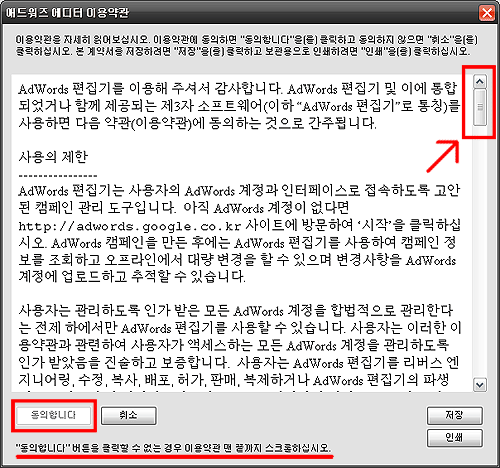
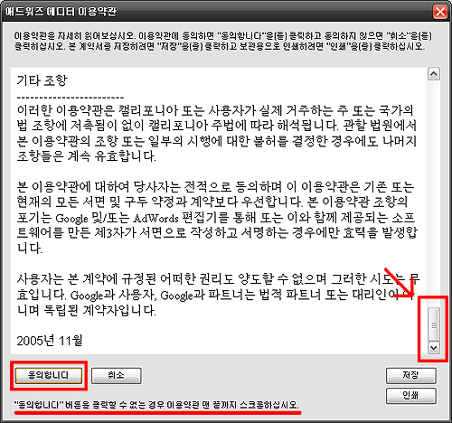

[구글 애드워즈](http://adwords.google.co.kr) 에디터를 설치했다. 여느 프로그램처럼 약관에 동의를 하려고 하는데 **[동의합니다]** 버튼이 활성화 되어있지 않았다.  

<!-- truncate -->

  

그리고 나서 살펴보니 약관을 전부 읽어보도록 스크롤바를 끝까지 내려야 [동의합니다] 버튼이 활성화되도록 구현되어 있었다.  
  
  

사실 이렇게 한다고 그 자리에 꼼꼼히 전부 읽어보는 사람이 많지도 않을테지만, 그래도 여러모로 좋은 구현이라고 생각한다. 중요한 내용이라고 각종 중요표시, 빨간글씨 등 오버하지 않고 깔끔하게 사용자의 액션을 유도할 뿐더러 결국 사용자들이 약관의 내용을 읽었다고 증명하게 만드는 센스까지 돋보였으니까.  
  
게다가 바로 옆에 저장 버튼과 인쇄 버튼까지 마련해 두었으니 할만큼 했다고 볼 수도 있다. 종종 작은 차이가 많은 것들을 의미한다.  
  
p.s.1  
다른 프로그램에서도 비슷한 구현을 본 것 같긴 한데, 도무지 기억이 안난다. @.@  
  
p.s.2  
웹어플리케이션에서도 똑같이 구현할 수 있을 듯 하다.)
