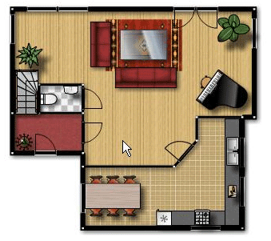

**2007.6.16.** **구글 이미지 검색, 얼굴만?**  
예를 들어, Paris로 검색하면 각종각색의 Paris와 관련하는 이미지, 파리의 풍경, 건축, 혹은 이름에 Paris를 포함된 사람들이 나온다.  
http://images.google.co.kr/images?hl=ko&q=paris&gbv=2  

<!-- truncate -->

그러나 지금 검색 주소 URL 검색 결과 뒤에 "&imgtye=face"를 더 추가하면 검색결과에서 얼굴 이미지만 나올 것이고 풍경 등 이지미가 사라진다.   
  
http://images.google.co.kr/images?hl=ko&q=paris&gbv=2&imgtype=face  
  
예전부터 저런 시도들이 간간히 있었는데, 구글 정도의 회사에서 시도하는 건 처음이 아닐까 싶다. [**Google Image Labeler**](http://images.google.com/imagelabeler/)가 한 역할 단단히 했으리라 추정해본다.  
  
[▶ 보러가기](http://chinatong.tistory.com/25)

  

**2007.6.15.** **미디어 다음 - 이 기사, 누가 봤을까?**  
기사를 클릭하면 발생하는 메타데이터를 데이타마이닝 기법을 이용해 연령별, 성별, 접속지역별로 보는 기사별 부가 콘텐츠 입니다. / 통계청에서 실시하는 인구주택총주사처럼 전체 인구를 대상으로 한 조사가 아니며, 모집단과 표본을 갖춘 여론조사와도 다른 방식입니다. / 이에 분석 결과값에 오차가 크게 발생할 수 있어 해당 서비스를 통계적으로 인용 할 수 없습니다. 말은 저렇지만 다음에 로그인하지 않은 사람들까지도 포함한 통계자료라고 한다. [**검색트렌드**](http://blog.daum.net/daumsearch/10922970)에 이은 또 하나의 재밌는 시도.  
  
[▶ 보러가기](http://mbbs.media.daum.net/notice/griffin/do/notice/read?bbsId=notice&articleId=276)

  

**2007.6.13.** **서울시 송파구 양심자전거 (무료 이용) 200대 배치**  
서울 자치구 최장 90.3km의 자전거도로를 가진 ‘자전거 특별구’ 송파구(구청장 김영순)에 노란색 자전거 송파-PUB (Public Use Bikes)가 탄생한다. 송파-PUB는 대여 및 반납 절차 없이 시간·장소에 구애받지 않고 누구나 편리하게 무료로 이용할 수 있는 자전거다. 노란색 송파-PUB가 눈에 띄면 누구든지 지하철역이나 버스정류장까지 타고 가서 대중교통으로 환승할 수 있다. 타고 간 송파-PUB는 근처의 자전거보관소에 세워두면 된다. 자물쇠로 채워야하는 번거로움도 없다. 이렇게 편리한 송파-PUB를 순수 자원봉사단체인 송파 라이온스클럽 (회장 이전)이 노란색 자전거 200대를 구매하여 운영하기로 한 것이다. 송파구 사시는 분들은 유용하게 사용하겠군요.  
  
[▶ 보러가기](http://sori1.songpa.seoul.kr/sori1/bodo/bd_view.asp?sno=1495)

  

**2007.6.11.** **내맘대로 가구배치를 해보는 플로어 플래너**  
  

가구 배치하기 전에 모양이 어떨지 미리 한번 테스트 해 볼 수 있는 서비스. 여러모로 재밌고 유용할 듯.  
  
[▶ 하러가기](http://www.floorplanner.com/)
