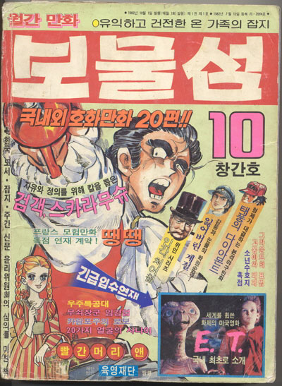

**2007.7.1.** **6월항쟁이 대화와 타협 이었단다.**  
"박효종·이영훈 서울대 교수 등이 나선다. 6·29선언은 "민의에 순응한 현명한 선택(박효종)"이었다며, "당시 국민과 정권의 상호 대화와 타협의 정신을 현 정권과 정치권이 새겨야 한다(이영훈)"고 말한다 .(중략) "대화와 타협" 에 대해 저런 정의를 가지고 있으니 노무현대통령이 아무리 "대화와 타협" 이야기를 해봤자 커뮤니케이션이 안되는 것이다. 노무현 대통령이 **"대화와 타협을 하자."** 고 하면 **"지금 공권력을 동원해서 우리를 다 죽이겠다는 거지?"** 하는 생각을 하게 될테니 이게 커뮤니케이션이 되겠냐고. 정말 저런 생각을 가진 쪽 사람이 대통령 되서 대화와 타협 해보자고 할까봐 정말 무섭다, 무서워.  

<!-- truncate -->

[▶ 보러가기](http://mogibul.egloos.com/3258855)

  

**2007.7.1.** **태극당 맛의 비밀**  
먹을 것 가지고 저러는 사람들, 먹거리를 우습게 보는 사람들에게는 정말 자신들이 만든 먹거리를 그대로 먹이는 벌이 있었으면 한다. 왜 이런 건 입법이 안될까?  
  
[▶ 보러가기](http://blog.empas.com/gundown/21972025)  
[▶ 장충동 태극당 위치](http://kr.gugi.yahoo.com/detail/detailInfo/DetailInfoAction.php?cid=2615078715)

  

**2007.6.30.** **80년대 대표 만화잡지 "보물섬"**   
부천만화정보센터의 한국만화박물관은 오는 24일부터 4월 30일까지 당대 최고 인기 잡지였던 ‘보물섬’을 기억하는 ‘보물섬 탐험전’을 연다. 아아, 기억난다. 정말 몇 번씩이고 책장이 닳도록 읽었던 기억들…  
  
  

이미지 출처 : [김지희의 CoolHot](http://www.kimjihee.com/tt/index.php?pl=333)  
[▶ 보러가기](http://www.kimjihee.com/tt/index.php?pl=333)

  

**2007.6.28.** **애플 아이폰을 한국에서도 쓸 수 있게 해봅시다.**  
제가 보기에는 KTF가 아이폰을 받아들일 가능성이 높아보이는데 / 아무래도 어려운 문제이기 때문에 의사결정을 하시는 분들에게 / 가능성을 보여드리면 좋은 결과가 있지 않을까 해서입니다. / 애플이 HSDPA를 지원하는 폰을 개발하고 아시아에서는 아무래도 일본의 우선 순위가 높겠지만 / 우리 나라는 전국에 HSDPA가 다 깔린 그리고 HSUPA도 도입된 나라니까 / 일본과 동시에 출시되면 좋겠다는 생각을 해보고 / KTF 분들이 그리고 혹시 SKT 분들도 분발하시기를 기대하면서 말입니다... ^\_\_^ 일본을 경유해 아이튠즈가 상륙할 거라는 풍문과 더불어 이찬진이라는 거물급 인사가 공개적으로 움직이기 시작했다. 들어오면 좋겠다. 이유는 단 하나 - 들어오는 여러 과정을 통해 폐쇄된 망이 풀렸으면 하는 바램. 솔직히 우리나라 무선 인터넷 망은 일반 소비자 (국민)들의 것이 아니잖아.  
  
[▶ 보러가기](http://clien.career.co.kr/zboard/view.php?id=free&page=1&sn1=&divpage=72&sn=off&ss=on&sc=on&select_arrange=headnum&desc=asc&no=376759)

  

**2007.6.25.** **지금 우리가 서있는 이곳이 바로 남한산성이구나**  
이제 시사저널 파업의 '일리아드'는 끝났습니다. 시사저널 창간정신으로 되돌아오는 '오딧세이아'가 시작되었습니다. 그 길에 여러분들이 동참해 주시기를 다시 한 번 부탁드립니다. 지루하고 긴 글, 끝까지 읽어주셔서 감사합니다. 일리아드든 오디세이든 기성 언론에 대한 신뢰는 금이 갔고, 시사저널 기자님들에 대한 기대는 커져가고 있다. 모쪼록 지식인이라는 사람들이 많이 도와줬으면 좋겠다.  
  
[▶ 보러가기](http://blog.daum.net/streetsisajournal/6710290)
