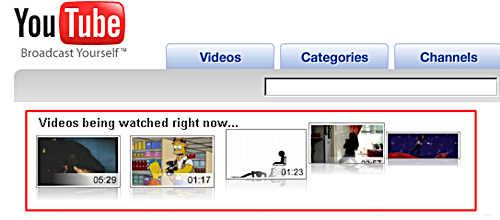

[**아이폰**](http://www.apple.com/iphone/) 때문에 세상의 geek들이 떠들썩합니다. :) 물론 일반인들도 떠들썩하죠. 여기 물건너 아이폰의 ㅇ도 구경할 수 없는 우리나라에서도 관심은 [하늘을 찌르는 듯](http://www.google.co.kr/search?hl=ko&q=%EC%95%84%EC%9D%B4%ED%8F%B0&btnG=%EA%B2%80%EC%83%89&lr=) 해요. (물론 특정 계층에서)

<!-- truncate -->

모 뉴스에서 **'아이폰에 결정적인 결함이 있다'**는 세계뉴스를 본 적도 있습니다. 알고 보니 대부분의 PDA폰이나 스마트폰 등이 가지고 있는 결함들이었어요. 예를 들면 - 배터리 수명이 생각보다 조금 짧다든지, 터치 스크린이 조금 불편한 것 같다던지, 인터페이스가 익숙치 않아 불편하다는 점 같은 것들이었죠. 제목은 '결정적인 결함'이라고 해놓고 정작 내용은 큰 타격이 될만한 게 없는 걸 보니 그만큼 아이폰을 팔아 이야기를 하면 인기를 얻는다는 반증인가보다 싶기도 했지요.

어쩄든, 아이폰에는 [**구글맵**](http://maps.google.com/)이 탑재되어 있다고 합니다. 인터페이스 자체에 구글맵 아이콘이 있는 걸로 보아 어플리케이션 수준으로 탑재가 된 듯 해요.

Google Maps on the iPhone
경쟁이 치열한 IT 업계에서 매니아와 열성적인 고정 팬들을 이끌고 있는 두 기업이 이렇게 만나는 건 우연은 아닌 듯 싶습니다. (물론 다들 아시다시피 이 두 기업만이 뭉친 건 아니지만요)

하지만, 요즘 제가 기대하고 있는 건 바로 유튜브 (YouTube)와 애플 TV (Apple TV)의 조합입니다.

* * *

맞아요, [**유튜브**](http://www.youtube.com)는 예전에 구글이 인수했죠. 이 유튜브의 대대적인 성공으로 인해 우리나라에서도 UCC라는 말이 모든 사람들에게 익숙한 말이 되어버렸습니다. (물론 다음 Daum의 공이 크지요.)

조금 다른 이야기지만, 영국의 국영방송인 [**BBC**](http://www.bbc.co.uk)는 아예 유튜브 안에 채널을 열었지요. 주소도 매우 쉽습니다. [**http://www.youtube.com/BBC**](http://www.youtube.com/BBC) 이죠. 전세계 인터넷 사용자들이 하루에 1억편이 넘는 동영상을 유튜브를 통해 감상을 한대요. 그러니 BBC 같은 기존 미디어들이 유튜브에 살짝 채널을 열어두는 것도 그리 이상할 게 없습니다. 새로운 TV 시리즈나 인기 TV 시리즈, 혹은 이슈가 되는 소재의 뉴스 꼭지들을 유튜브에 슬쩍 흘리는 거죠. 아주 효과적인 홍보 채널입니다. 그 자체로 방송 채널이기도 하고요.

그렇다면, 이건 어떤가요. 애플은 [애플 TV에 유튜브를 연결하기로 결정](http://www.apple.com/appletv/tour.html?section=youtube)했지요. 이에 화답하듯 구글은 자사의 모든 비디오를 애플 아이 티비와 아이팟, 아이폰의 동영상 규격인 H.264 에 맞추기로 [**결정**](http://www.ilounge.com/index.php/news/comments/apple-exec-details-160gb-apple-tv-youtube-h264-deal/)을 했어요.

Apple TV - Youtube Tour
이건 정말 대단한 사건의 시작이라 생각합니다. 애플 TV는 거의 무한대에 가까운 컨텐츠를 보급해 줄 천군만마를 얻었고, 구글은 유튜브를 통해 자사의 영향력을 대대적으로 떨칠 수 있게 되었으니 말이죠. 게다가 이 H.264 코덱의 선택으로 인해 유튜브는 아이튠즈로의 진출도 가능해졌고요. 아이튠즈에서 만나는 '신나는 전세계 동영상 (UCC)'이라니. (물론 무료일테고, DRM free 겠지요.)

이런 식으로 계속해서 뉴미디어를 애플 TV(와 아이팟, 아이폰)에 온라인으로 연결시킬 수 있다면 애플은 기존의 방송사나 유료 케이블 TV들을 충분히 위협하는 회사로도 커나갈 수 있을 것입니다. 구글은 적당한 기회를 봐서 슬쩍 광고를 껴 넣기만 하면 완전한 청정해역 - 블루 오션을 개쳑하는 것일 테고요.

왜 애플이 애플 컴퓨터 (Apple Computer, Inc)에서 애플 (Apple, Inc)로 회사 이름을 변경했는지 점점 명확해지는 요즘입니다. 또한 컨버전스의 개념을 보다 분명하게 실현시키는 구글과 애플의 모습에 대단함을 느낍니다.

**덧붙여**

우리나라 상황을 떠올려 보자면, 애플의 역할을 할 수 있는 업체들로는 일단 [**하나TV**](http://www.hanatv.co.kr/)가 있겠군요. 그리고, [디지털 케이블 DV](http://www.dvdv.co.kr/)나 [메가TV](http://tv.megapass.net/) 같은 것도 있고요.

그럼 유튜브 역할은 누가 맡을까요? 당연히(?) 요즘 홈페이지의 타이틀에도 대놓고 우리들의 UCC 세상이라고 홍보하는 중인 [**다음 Daum**](http://www.daum.net) 이 맡으면 될 것 같군요. 이런 컨셉이라면 다음이라면 충분히 노려봄직한 조합 아닐까요? 요즘 한창 구글 따라잡기에 열심이던데, 이런 것도 한번 시도해보는 것도 나쁘지 않을 듯 해요. 미디어를 꿈꾸는 다음이 원하는 형태이기도 하니까 말이죠. :)

**덧붙여 2**

이렇게 생각하고 보니 유뷰브의 첫 화면에서 지금 인터넷 사용자들이 보고 있는 비디오를 보여주는 섹션의 애니메이팅이 꼭 애플스럽군요. :p

