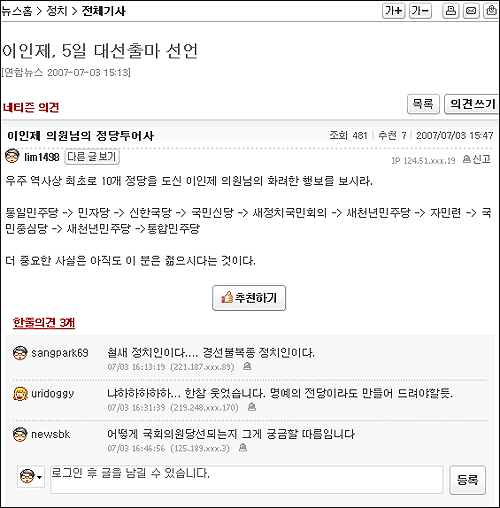

  

<!-- truncate -->

출처 : [**연합뉴스 (네이버) - 이인제, 5일 대선출마 선언**](http://news.naver.com/news/read.php?mode=LSD&office_id=001&article_id=0001684830&section_id=100&menu_id=100) 기사 [댓글 중에서](http://news.naver.com/news/read.php?&mode=LSD&office_id=001&article_id=0001684830&section_id=100&menu_id=100&m_mod=memo_read&m_page=1&m_view=1&m_st=title&m_sw=%C5%F5%BE%EE&m_p_id=-25&memo_id=34685)  
  
한 줄에 한 당씩 적어보자.  
  
통일민주당  
민자당  
신한국당  
국민신당  
새정치국민회의  
새천년민주당  
자민련  
국민중심당  
새천년민주당  
통합민주당  
  
오오- 10개.  
  
  
  
  
  
그렇다면…  
  
  
  
  
이제 남은 건 민노당 뿐? 
