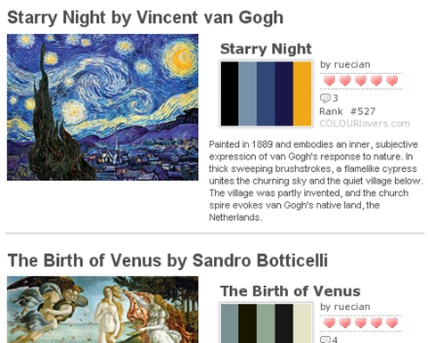

**2007.7.15.** **美 복음주의자들, 위키피디아 맞서 `콘서버피디아` 개설**  
콘서버피디아의 창설자인 앤디 쉴라플라이는 "위키피디아의 글을 편집하려고 했 으나 이 사이트를 지배하는 편견에 찬 편집자들이 자신들의 견해에 맞춰 검열하거나 사실을 수정했다"며 "진화론에 반대되는 사실들은 거의 즉각 검열받았다"고 말했다. / 쉴라플라이는 위키피디아에 수록된 많은 글들이 미국 영어 대신 영국 영어를 자주 쓰고, 르네상스에 끼친 기독교의 공로를 인정하지 않으려 한다고 지적했다. / 쉴라플라이는 페미니즘과 남녀평등헌법 수정안에 대한 반대로 유명한 미국의 유명한 보수파 인사인 필리스 쉴라플라이의 아들이다. 미국에 뒤질세라 한국에서도 오늘 [**월간 박정희가 창간**](http://news.media.daum.net/society/media/200609/27/dailyseop/v14179662.html) 되었다. 두둥- (물론 양쪽 성격이 조금 다르긴 한 듯 하지만) 그나저나 미국 영어를 안쓰고 영국 영어를 쓴다고 하니 문득 어느날, 조카가 한 말이 떠오른다. "삼촌, 왜 미국은 자기네 말도 없어요? 영어는 영국말이잖아요."  

<!-- truncate -->

[▶ 기사보기](http://news.mk.co.kr/newsRead.php?sc=30000006&cm=%EA%B5%AD%EC%A0%9C%20%EB%A9%94%EC%9D%B8&year=2007&no=108341&selFlag=&relatedcode=&wonNo=&sID=303)

  

**2007.7.13.** **악기 중의 악기, 그러나 처절한 구도자 같은 악기**  
그렇게 구도자처럼 ‘완벽한 리드’로 완성되길 꿈꾸며 리드를 깎아야 하기에 오보에는 고통스러운 악기입니다. 다른 악기라면 그런 과정조차 필요가 없지요. 그런 수고로움을 즐기지 못하면 오보에란 악기는 불 수가 없습니다. 게다가 소리를 내기도 그만큼 더 어렵습니다. 그래서 오보이스트들은 오보에에 대해 무한한 자부심을 가집니다. / 다음에 오보에 소리를 듣게 되시면 그 아름다운 소리를 위해 오보이스트들은 얼마나 많이 리드를 깎으며 골머리를 썪었을까 한번 생각해보시면 어떨까요? 그런 고통을 거쳤을 것이 떠오르기에 제 귀에는 오보에 소리가 왠지 더욱 아름답게 들린답니다. 오보에의 묘한 음색에는 이유(?)가 있었구나. 글쓴이의 제안처럼 다음에 오보에 소리를 듣게 되면 한번쯤 다시 생각할 것 같다. 새로운 즐거움 하나를 선사해준 구본준님에게 다시 한번 감사를-  
  
[▶ 보러가기](http://blog.hani.co.kr/bonbon/5149)

  

**2007.7.12.** **한겨레 필통 열린사전**  
무언가 필요한 게 있어서 구글링을 했는데 내가 원하는 답을 찾고 보니 한겨레 필통 열린사전이었다. 그런데, 재밌는 건 답변의 출처가 바로 네이버 지식인. 즉, 네이버 지식인의 답변을 퍼온 것이다. 잠깐, 이거 재밌네. 충성스런 사용자들을 모집해서 쓸모있는 네이버의 답변을 골라다가 퍼서 답변을 하는 거야. 그러면서 자체 답변량도 쌓아나가면서. 그럼 구글을 비롯한 여러 검색엔진에서는 결국 여기 링크가 발견될 것 아닌가. 게다가 어차피 네이버 지식인도 퍼다 담은 답변들이 부지기수이기도 하고.  
  
공성전 하듯이 누가 제대로 한번 해봤으면 하는 생각을 잠시;;;  
  
[▶ 보러가기](http://hantoma.hani.co.kr/opendic/)

  

**2007.7.9.** **명화에서 느끼는 색채감**  
  

이거 왠지 제대로 웹2.0 스러운데? :p  
  
[▶ 보러가기](http://www.colourlovers.com/blog/2007/06/20/color-inspiration-from-the-masters-of-painting/)
