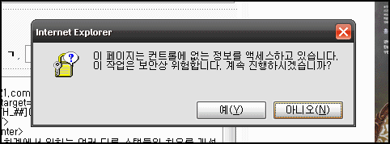
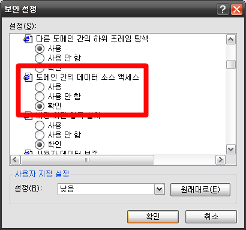

  

몇일 전에 윈도우를 새로 깔고 여러 보안패치를 적용했습니다.  

<!-- truncate -->

그런데, 인터넷 익스플로러에서 블로그에 글을 쓸 때, **태그를 입력하려고 하면 저런 메시지가 나오더군요.** (참고로 제 블로그는 태터툴즈 클래식이고, 다른 브라우저에서는 저런 메시지가 나오지 않습니다.) 저 메시지 때문에 태그 입력을 못하겠어요. @.@  
  

이 페이지는 컨트롤에 없는 정보를 액세스하고 있습니다.  
이 작업은 보안상 위험합니다. 계속 진행하시겠습니까?

  
인터넷 익스플로러의 보안설정을 변경하면 될 것 같긴 한데, 이것저것 시도해보았으나 여전히 나오더라고요. -\_-;  
  
혹시 아시는 분 계시면 도와주세요;;;  
  
  

자문자답  
  

  
메뉴의 도구 -> 인터넷 옵션 -> 보안 -> 사용자 지정 수준 -> 1/5 정도 위치에 있는 도메인 간의 데이터 소스 액세스가 확인으로 되어 있으면 저렇게 계속 물어보더군요.  
  
이올린의 추천 태그들을 읽어오느라 계속 확인이 필요했나 봅니다.  
  
사용으로 하면 물어보지 않더군요.  
  
(아아, 속 시원해.)
