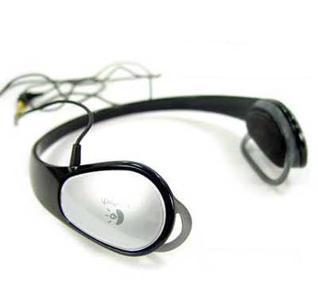
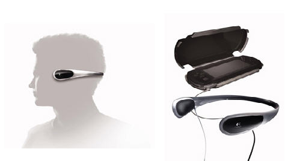

아예 대놓고 PSP용 헤드폰을 표방하는 로지텍의 플레이기어모드 헤드폰 (Logitech Playgear Mod Headphone) 을 샀습니다. 산 이유는 두 가지.  

<!-- truncate -->

1. **싼 가격.** 3~4만원 했었는데 요즘 8,800원에 팔리고 있습니다. 제가 산 곳은 [**옥션**](http://corners.auction.co.kr/Product/ProductDetail.aspx?catalog=40479).  
2. **편한 착용감.** 헤드폰 형태이면서도 머리 위에 얹지 않고 뒤쪽으로 뺀 스타일이라 머리가 눌리지 않고, 비교적 귀를 탄탄하게 조여줘서 흔들리거나 하지 않아요. 안경 쓴 분들도 편하게 사용할 것 같아요.

  
  
  

들어본 후의 소감은,  
  

기대했던 것 보다 **음질이 별로입니다.**;;

  
(뭐 이런 작은 헤드폰, 이어폰의 출력이라는 게 다 거기서 거기이긴 한데) 이건 여느 인기있는 이어폰들과 비교해볼 때 출력이 조금 작아요. 오픈형이기 때문에 더 작게 들리는 경향도 있겠죠. 그리고, 중저음이 좀 약하기도 하고, 전체적으로 다이나믹 레인지가 좀 좁은 것도 있어요.  
  
만원짜리 헤드폰에 뭘 바라는가 싶기도 해요. 아마도, 원래 팔리던 금액이 3-4만원이라고 알고 있기 때문에 드는 생각들이겠지요.
