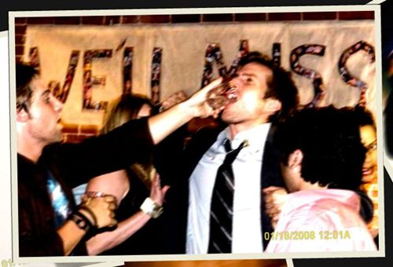
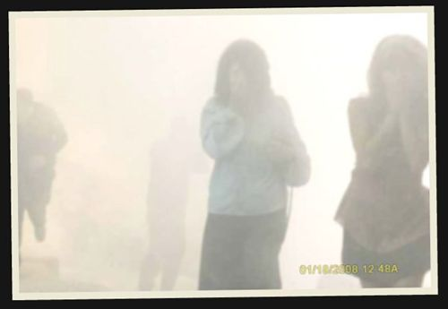
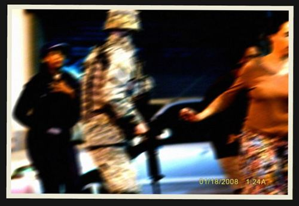
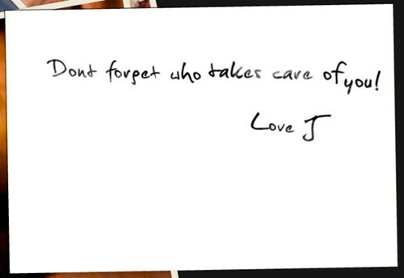
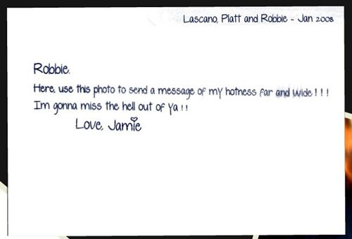
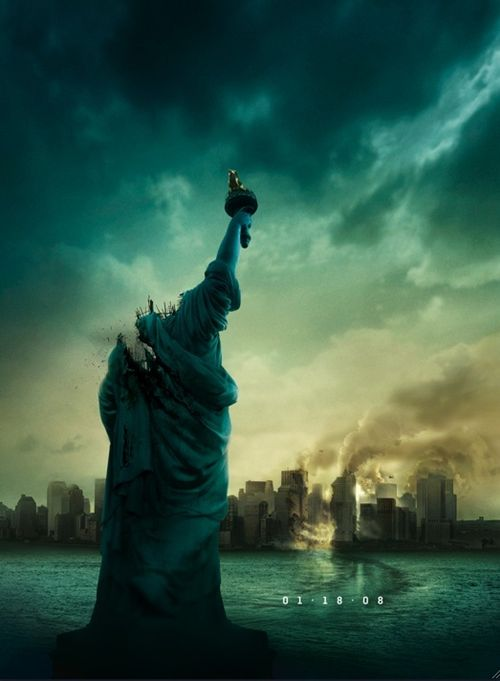

언제나 최고의 떡밥 (혹은 토끼발)만을 던지는 J.J. 에브람스 (J.J. Abrams)의 새로운 프로젝트. 이번엔 아예 영화제목을 밝히지도 않은 상태에서 여러가지 정보들을 쏘아올리고 있습니다. 단지 cloverfield 라는 개봉예정 날짜를 제외하고는 코드네임이 알려진 전부지요.  

<!-- truncate -->

  
  
  
1-18-08 aka Cloverfield teaser trailer  
영화 <트랜스포머> 상영 전 예고편 격으로 처음 나와 알려졌다고 하죠. (물론 미국에서의 상영이겠지요) 큰 폭발과 함께 자유의 여신상의 머리가 바닥에 내동댕이쳐지는 아주 강한 영상임에도 불구하고 이 영상에는 감독의 이름도, 제목도 그 어느 것도 나오지 않습니다. 이쯤되면 정말 미스테리를 사랑하는 미국에 걸맞는 바이럴 마케팅이라 하겠습니다.  
  
그냥 단지 1-18-08 이라고만 알려져 있는데, 참 대단해요. 아예 개봉 날짜를 사람들의 입에 오르내리게 만들다니 말이죠. 여러가지 정황상(?) 혹은 사람들의 추측에 의하면 괴수영화라고들 하더군요.  
  
J.J. 애브람스가 프로듀서를 맡고, <버피 더 뱀파이어>와 <앨리어스>, <로스트>의 각본가 드류 고다드 (Drew Goddad)가 각본을 맡고, <기네스 펠트로우의 졸업> (The Pallbearer)의 감독인 맷 리브스 (Matt Reeves)가 감독을 맡는다고 합니다.  
  
공식 사이트 [**1-18-08.com**](http://www.1-18-08.com/)에 사진들이 올라오고 있습니다. 현재 5장이 올라온 상태죠.  
  
  
  
  
  
  
3번째 사진을 좀 더 확대해 보면 뭔가 보이는 듯 합니다. 사람인지 어떤 다른 생명체인지는 확실치 않지만 얼굴처럼 보이는군요.  
  
  
또한, 위의 다섯장의 사진 중에 두 장 (첫번째 사진과 두번째 사진)을 마우스로 잡고 흔들면 아래의 메시지가 나옵니다.  
  
  
  
  
많은 사람들이 [이 영화의 제목을< Monstrous>라고 추측](http://www.darkculture.net/cloverfield/monstrous02.jpg)하고 있기도 한데 J.J. 애브람스 감독은 이 마저도 노 코멘트라고 하는군요. 하긴, 제 생각에는 어떻게 이 프로젝트의 코드네임이 Cloverfield라고 알려졌는지가 더 궁금하긴 해요. 어쨌든 적절히 알려줄 걸 알려주면서 정보를 통제하며 미스테리를 키워가는 J.J. 애브람스의 실력은 정말 대단합니다. :p  
  

