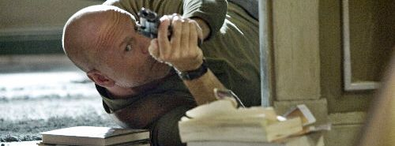

  

Live Free Or Die Hard  
Die Hard 4.0  

<!-- truncate -->

와- 1편으로부터 20년 만이예요. 브루스 윌리스는 이제 돌이킬 수 없을 정도로 나이가 들어버렸지만 그래도 영화는 재미있엇습니다. '디지털 시대의 아날로그 형사' 라는 문구가 각종 평에 사용되길래 이런 멋진 표현을 누가 생각해낸 걸까 싶었는데 영화 속 대사에 있던 거였더라고요. :p  
  
CG 보다는 실제 액션으로 화면을 구성하는데 중점을 뒀다고 하던데, 그 효과가 멋졌습니다. 특히 초반에 존 맥클레인 형사가 열 받아서 자동차로 헬기를 두동강 내버리는 장면은 혹시라도 존 맥클레인이 어떤 사람인지 가물가물해진 사람들로 하여금 예전의 활약상을 떠올리게 하는 효과를 준다고 생각할 정도로 멋졌어요. 나이들어 노련해진 베테랑의 느낌이 물씬 났다고나 할까요? :)  
  
좁은 공간에서 싸워야 그 매력을 발산하는 시리즈의 특성을 최대한 살릴 수 있도록 설정한 공간들도 영리했다고 봐요. (개인적으로 3편이 시리즈 중에서 제일 맥빠진 영화였다고 보는데, 그 이유는 존 맥클레인 형사가 뛰어다니는 공간이 너무 넓었기 때문이예요.)  
  
그나저나 전 화면에 대해서는 아무 것도 모르지만 보면서 특이하게 느껴진 점이 있는데, 그건 바로 카메라의 앵글이었어요. 특히 자동차 추격 장면에서 느낀 게 있어요.  
  
일단 - 간혹가다 긴박한 상황과는 대조적으로 좀 느리게 운전하며 촬영한 것 같은 장면이 있었는데, 그건 대부분의 영화들이 그렇듯이 음향과 음악이 커버해줬죠.  
  
그런데, 몇몇 장면에서는 묘한 속도감이 느껴지는 겁니다. 카메라 앵글 때문인지, 카메라의 움직임 때문인지는 잘 모르지만 분명히 보통의 액션 영화에 나오는 자동차 추격 장면보다는 빠르다는 느낌이 들더라고요. 이게 몇 프레임씩 잘라먹고 붙인 정도라면 어색한 티가 났을 법도 한데, 그런 것도 아닌 것 같았고요. 보면서 자동차를 따라가는 카메라의 묘한 각도 때문이 아닐까 하는 생각을 하며 속도감을 느꼈어요.  
  
다시 한번 보게 될 기회가 있으면 자세히 관찰하며 봐야겠습니다.  
  
그나저나 브루스 윌리스가 이번 편에 아주 만족했나봐요. 벌써부터 5편에 대한 이야기를 흘리고 다니는 걸 보면 말이죠. 20세기 폭스사에게 5편을 만들면 출연할 거라고 말하는가 하면, 이번 영화의 프로모션차 [세컨드 라이프](http://secondlife.com/)에 들어가서는 다음 편은 <다이 하드> 시리즈의 프리퀼이 될지도 모른다는 말도 했다고 해요. 그런데, 글쎄요… 아이디어는 좋지만 매우 뛰어난 특수효과 기술이 필요할 듯 싶어요. :p  
  
 /  / 
