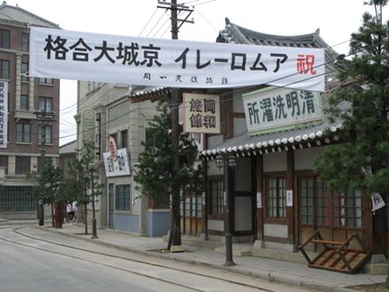
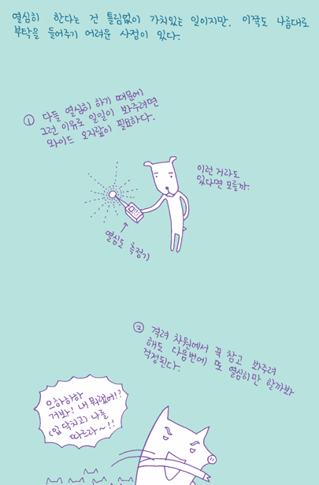

**2007.8.11.** **스타뉴스 - 커프', 동성애 넘어 야오이의 안방침투④**  
공유는 극중 윤은혜에 대한 감정이 커져만갈수록 자신의 성 정체성에 대한 혼란을 겪으며 정신병원 상담까지 받는 등 실제 동성애자들의 공감대까지 형성했다는 평가도 있다. 실제로 동성애자들 사이에서 공감대를 형성하며 '커피프린스 1호점'의 애청자가 많이 있다는 게 연예 관계자의 설명이다. 사실 덕후는 어디에나 있다. 오덕오덕~  

<!-- truncate -->

[▶ 기사보기](http://star.moneytoday.co.kr/view/stview.php?no=2007080811522252542&EVEC)  
  
  

KBS 드라마 경성스캔들의 세트장  
  
  

KBS 드라마 아이엠샘

  

**2007.8.9.** **올드독의 TV 노트 - 열심히 했다고 좋아할 순 없잖아요**  
  

'열심히'와 '잘'은 분명히 다르다. 물론 그에 대한 우리의 판단도 (직업이 아닌 이상) 때때로 다르다.  
  
[▶ 보러가기](http://www.magazinet.co.kr/Articles/article_view.php?article_id=46489&mm=007003000)

  

**2007.8.6.** **똥을 싸라 (Show를 하라 패러디)**  
  
언제나 시장 점유율 뿐만 아니라 광고에서까지 SKT에 밀리던 KTF가 쇼(SHOW) 하나로 전세를 역전시켰다. **'쇼 곱하기 쇼는 쇼, 쇼 곱하기 쇼 곱하기 쇼는 쇼'** 는 승리의 축포 같은 인상이다. 위의 영상은 해당 광고의 패러디.  
  
[▶ 보러가기](http://www.mncast.com/mainFrame.asp?mainSubMenu=/player/index.asp?mnum=2649292)
