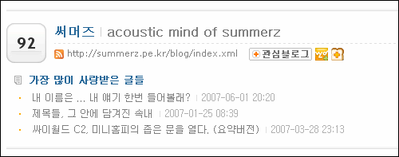

  

<!-- truncate -->

  

올해 3월부터 바빠지면서 예전에 비해 제대로 블로깅을 못했었습니다. 개월수로 따지자면 바빠지기 시작한지 이제 6개월 정도 됐는데, 바쁘더라도 나름의 블로깅 패턴을 찾아 블로그를 잘 운영할 것 같으면서도 점점 소흘해진 게 사실이어서 조금 아쉽던 차에 올블로그 어워드 순위 안에 든 건 아무래도 **'앞으로 열심히 블로깅 하셈- :p'** 이라고 유혹하는 것 같습니다. (아, 아슬아슬해~ ^^)  
  
이제껏 평상시 목표를 굳게 세우고 돌진하는 스타일과는 거리가 멀게 살아왔는지라 바쁘면 바쁜대로, 한가하면 한가한대로 큰 자극을 피해가며 사는데, 이렇게 뭔가 순위에도 들고, 축하한다는 말을 들으니 한번쯤 돌아보게 됩니다.  
  
올블로그도 계속해서 변화를 시도하고, 점점 앞으로 나아가고 있지요. 때론 그 변화가 마음에 들지 않을 때도 있고, 변화의 폭이 작아서 혹은 커서 낯설 때도 있지만, 언제나 열심히 즐겁게 일하시는 게 보기 좋습니다.  
  
  
저 역시 지금 하고 있는 일들 더욱 열심히 해야겠고, 하고 싶었지만 마음에만 담아뒀던 일들도 차근차근 계획해서 실마리를 풀어보고, 조금 더 집중하며 살아야겠습니다.  
  
어쨌든 선정된 모든 블로거님들 축하드리고, 저 역시 감사드립니다. (이제껏 까먹은 점수 만회하려면 남은 기간 열심히 해야할 듯;; )  
  
아래의 글 3개가 제일 인기있었다고 하는군요. ^^  
  

[▶ 어쿠스틱 마인드 - 내 이름은 ... 내 얘기 한번 들어볼래?](http://summerz.pe.kr/blog/index.php?pl=1023)  
[▶ 어쿠스틱 마인드 - 제목들, 그 안에 담겨진 속내](http://summerz.pe.kr/blog/index.php?pl=915)  
[▶ 어쿠스틱 마인드 - 싸이월드 C2, 미니홈피의 좁은 문을 열다. (요약버전)](http://summerz.pe.kr/blog/index.php?pl=974)
