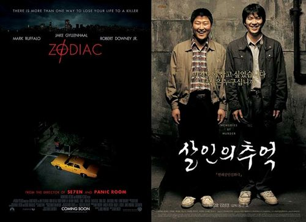
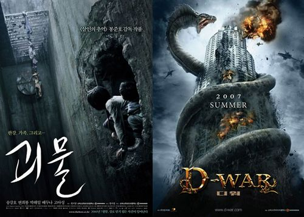
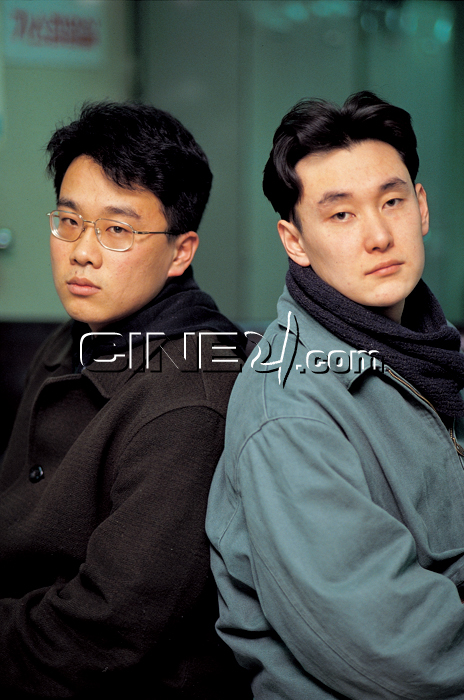

뜬금없이 봉준호 감독 관련 잡담 세 가지  

<!-- truncate -->

**1** **<조디악>과 <살인의 추억>**  
  
  

데이빗 핀처 감독이 이전 영화들과 전혀 새로운 형식으로 만들어낸 영화 <조디악> (Zodiac, 2007)은 미국의 1960, 70년대 전 미국을 공포에 떨게 만들었던 연쇄살인범 '조디악 킬러'에 대한 이야기이다. 실제로 흥행과 비평적인 측면 모두에서 찬사를 받았던 데이빗 핀처의 전작 <세븐> (Se7en, 1995)은 이 사건을 모티브로 만들어진 영화였다.  
  
그런데, 이 영화 <조디악>은 국내에서 헐리우드판 <살인의 추억> (2003)으로 마케팅을 하고 있고 실제로 영화를 본 사람들 사이에서, 영화 잡지들 사이에서 이 두 영화가 그렇게 비교가 되고 있다. 한 나라를 공포에 떨게 만들었던 실화를 바탕으로 만들어졌고, 영화의 결론도 실제 영구 미제 사건을 변형하지 않는 선에서 마무리 되었기 때문이다.  
  
<살인의 추억> 제작 당시 <세븐>도 많이 참고했다고 알고 있는데, 이제는 '<살인의 추억>이 더 재밌네', '<조디악>이 더 멋지네' 하는 말들이 나오고 있다.  
  
(물론 두 영화는 스타일이 완전히 다르다. <살인의 추억>이 변칙복서라면 <조디악>은 인파이터라고나 할까…)  
  
어쨌거나 기분 좋겠다. :)  
  
**2** **100분토론, <괴물>과 <디 워>**  
  
  

예전에 봉준호 감독이 씨네21과 한 인터뷰가 충무로의 편견을 단적으로 드러낸 게 아니라는 말이 아니냐는 말이 돌고 있다.  
  
> <괴물>을 만드는 과정에서는 수모, 편견, 구박, 우려가 장난 아니었다. 손익분기점을 넘어섰을 때 가장 기뻤다. 누구 말대로 이무기 나오는 영화 찍다가 망하는, 그것도 나 혼자가 아니라 한국영화 산업에 파탄을 일으킬 수 있는 대재앙이 안 일어나 천만다행…  
>   
> 출처 : [**씨네21**](http://www.cine21.com/) (이라는데 지금 찾아보니 같은 문장이 있는 기사를 찾을 수가 없다; )

  
여기서 "누구 말대로 이무기 나오는 영화 찍다가 망하는" 이라는 표현이 "누구처럼 이무기 나오는 영화 찍다가 망하는" 으로 와전되서 본의 아니게 공격 당하고 있다는 것.  
  
그런데, 내가 보기에는 <괴물>의 괴물은 아무리 봐도 이무기를 떠올릴만한 모양이 아니다. 즉, 봉준호 감독의 생각이 아니더라도 누군가 '이무기' 운운하며 조롱했다는 거겠지. 만약 '이무기' 영화가 제작 중이 아니었다면 '어설픈 용가리 영화', '골벵이 영화' 이런 식으로 조롱하지 않았을까?  
  
어쨌든 <디 워> (D-War, 2007) 를 두고 100분토론도 방송을 한다고 해서 이제껏 100분토론에서 영화를 주제로 방송했던 걸 찾아보니 다음과 같다.  
  

2007-08-09 "디-워”(D-WAR), 과연 한국영화의 희망인가   
2006-08-17 '괴물’ 싹쓸이 논란   
2006-02-02 스크린 쿼터 축소 논란   
2005-10-06 부산국제영화제 10주년 특집 - 한국 영화의 경쟁력은   
2005-02-03 '그 때 그 사람들’ 판결 논란   
2003-06-19 '스크린 쿼터’ 논란, 그 해법은  
  
[**MBC 100분토론**](http://www.imbc.com/broad/tv/culture/toron/) 중 영화 관련 방송 리스트

  
하긴 100분토론이 대체로 사회적인 토론 거리가 있는 것들에 대해 토론을 하는데, 개별 영화로는 <그 때 그 사람들>을 말고는 <괴물>과 <디 워> 모두 괴수영화다. 오오-  
  
(괴수가 나오면 이렇게 대박이 터지니 제작자 분들, 앞으로도 괴수 영화 많이들 만들어주셈-)  
  
**3** **봉준호 감독과 장준환 감독**  
  
  
하하- 재밌다. 참고로, 봉준호 감독과 장준환 감독은 영화 아카데미 동기라고 한다. 예전에 둘이 찍은 사진을 함께 보니 더 재밌다.  
  
  

아, 풋풋한 두 감독 (출처 : 씨네21)
