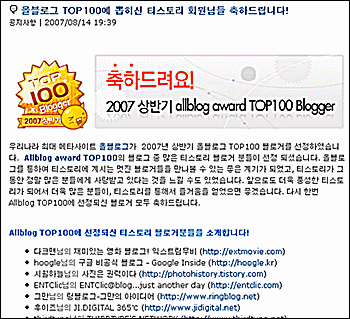
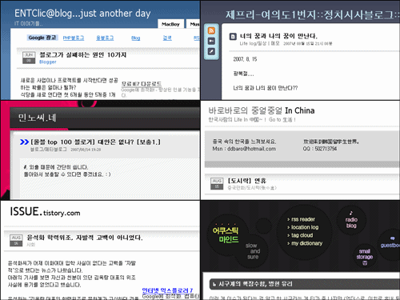

티스토리 공지 블로그에 올블로그 TOP100 에 뽑힌 블로거(블로그)를 소개하는 걸 보다가 문득 저도 뭔가 그런 걸 할 수 있지 않을까 생각해봤습니다.  

<!-- truncate -->

  
티스토리에만 무려 42개의 블로그가!  
제 머리 속에 떠오른 것은 'TOP100 중에서 제가 만든 스킨을 사용하는 블로거분들이 얼마나 있을까?' 였습니다. 그래서, 찾아봤지요. 제가 여기에 사용하고 있는 스킨도 제가 만들었으니, 저까지 포함해서(^^) 총 6분이더군요. :)  
  

[ENTClic@blog...just another day](http://entclic.com/)  
[제프리-여의도1번지::정치시사블로그::이정기](http://epolitics.or.kr/tt/)  
[민노씨.네](http://minoci.net/)  
[바로바로의 중얼중얼 In China](http://www.ddokbaro.com/)  
[ISSSSSUE](http://issue.tistory.com/)  
그리고 [어쿠스틱 마인드](http://summerz.pe.kr)

  
  
스킨이야 블로그를 운영하면서 필요에 의해 바꾸기도 하고, 분위기 전환 삼아 바꾸기도 하고 하는 거니까 특정 스킨을 사용한다는 게 큰 의미는 없지만, 어떻게 보면 또 하나의 스킨을 정한다는 게 쉬운 결정만은 아닌 걸 알고 있으니까요. 그리고, 그냥 뭐… 이렇게 모아보는 것도 재밌잖아요. ^^  
  
사실 평상시에도 위의 분들을 포함해서 제가 만든 스킨을 사용하고 계시는 많은(?) 블로거분들에게 무한한 감사함을 느끼고 있습니다. (처음 들어간 블로그에 제 스킨이 사용되고 있을 때 깜짝깜짝 놀라곤 합니다. ^^) 다시 한번 제 스킨을 사용하시는 모든 분들께 감사함을 전합니다. :)
