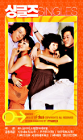
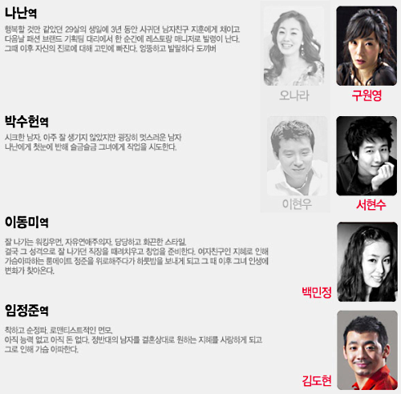

**원작**  

<!-- truncate -->

장진영, 엄정화, 이범수, 김주혁이 각각 나난, 동미, 정준, 수헌이라는 인물을 연기했던 영화 [**<싱글즈> (2003)**](http://www.sidus.net/movie/singles/)가 이 뮤지컬의 원작입니다. 실제로 [**뮤지컬 <싱글즈>**](http://www.gmdaewoo.co.kr/musical/stage/info/singles_intro.jsp)의 전체적인 내용은 영화를 본 분들이라면 거의 예상 가능한 방향으로 진행될 정도니까요.  
  
영화 <싱글즈> 역시 원작이 있는데, 카마다 토시오의 소설 <29세의 크리스마스>가 바로 그것이지요. 재밌는 건 이 소설은 1994년 일본 후지 TV에서 방영된 10부작 드라마 <29세의 크리스마스>를 소설화시킨 거고요. 따라서 정확하게 따지면 **일본 드라마 > 일본 소설 > 한국 영화 > 한국 뮤지컬** 순으로 작품들이 만들어진 건데, 참 대단합니다. 원작이 가진 힘이겠지요.  
  
**차이**  
  
제가 기억하고 있는 영화 <싱글즈>는 나이 스물 아홉 젊은이들의 일과 사랑, 꿈과 현실에 대한 이야기를 소소한 에피소드를 통해 보여주는 괜찮은 영화였습니다. 때론 가볍게, 때론 진지하게 작은 이야기들을 모아가며 보여주는 방식도 좋았고요.  
  
뮤지컬 싱글즈는 확실히 영화를 이미 감상한 분들이 더 즐기기 좋은 뮤지컬이라고 생각됩니다. 그만큼 영화와 큰 차이가 없다는 거죠. 그럼에도 굳이 인물묘사에 대한 차이점을 말하라면 아래와 같습니다.  
  

- 나난의 성질이 별로 과격하지 않다.  
- 동미가 섹스를 밝힌다는 설정이 잘 표현되지 않았다.  
- 정준은 능청스러움이 빠지고 순수함이 강조되었다.   
- 수헌이 적극적인 작업남이라기 보다는 마음씨 착한 왕자님 느낌이다.

  
즉, 영화의 캐릭터들에 비해 전체적으로 동글동글해진 느낌이랄까요?  
  
**배우**  
  
영화를 본지가 좀 오래되어서 정확한 에피소드들이 기억나지 않았는데, 뮤지컬이 진행되면서 하나씩 새록새록 기억이 나더군요. 익숙한 이야기에 배우들이 노래를 부르니까 색다른 감성이 살짝 입혀지는 느낌이 좋았습니다.  
  
실제로 뮤지컬 배우들의 연기를 보면서도 영화의 캐릭터를 최대한 유지하려고 노력한 게 느껴졌어요. 심지어 장진영의 말투, 엄정화의 말투 등 배우들의 말투까지 종종 비슷했거든요.  
  
  
나난과 수헌 역은 더블캐스팅이었는데, 제가 본 건 구원영과 서현수였습니다.  
이현우가 출연해서 유명한 뮤지컬이던데, 제가 본 공연은 구원영 (나난 역), 서현수 (수헌 역)가 출연했습니다. (더블캐스팅이죠) 물론 백민정 (동미 역), 김도현 (정준 역)도 함께요. 이현우의 연기를 보지 않아서 모르겠지만 제가 본 배우들의 연기는 아주 좋았습니다. 서글서글한 인상의 서현수는 마치 조인성과 지진희를 합쳐놓은 것 같더라고요.  
  
김도현은 배역의 느낌상 이병진 같은 느낌이 들었는데 (영화에서의 이범수도 비슷한 느낌이죠) 듬직한 목소리가 안정감이 있더군요. 전체 뮤지컬 중에서 딱 한 장면 꼽으라면 김도현이 연기한 정준이 중간에 술 먹고 노래부르는 장면이 기억에 남습니다. 중얼거리는 듯한 느낌으로 시작해서 열창을 하며 마무리하는 게 멋지더라고요. :)  
  
하나 더 꼽으라면 나난과 동미, 정준이 함께 술을 마시며 스무살의 나는 대학에 들어가는 게 소원이었다고 말하는 장면 (영화 속에서는 '스무살의 우리는 모두 집을 나가는 게 소원'이었다고 하던가요?)도 기억에 남습니다.  
  
**음악**  
  
개인적으로 음악은 어디선가 들어본 듯한 느낌이 들 정도로 익숙한 멜로디였습니다. 80년대말 ~ 90년대 대중가요의 느낌이 많이 느껴졌다고나 할까요? 이게 창작 뮤지컬이라는 관점에서 봤을 때 득인지 실인지는 잘 모르겠지만 전 편안해서 좋았습니다.  
  
게다가 음악이 단순히 배우들의 노래를 위한 도구가 아니라 극의 흐름과 분위기를 잘 맞춰주도록 짜임새 있게 구성되어서 더 좋았습니다. 사실 여러 뮤지컬들 (특히 창작 뮤지컬들)이 좀 그렇잖아요. "자, 이제 노래 시작한다~ " 하는 느낌을 주면서 노래하는 거요. 그런 게 없다는 거죠.  
  
오히려 나중엔 끊임없이 나오는 음악이 조금 과도한 듯 한 느낌도 들고, 극도 조금은 빠르게 진행되는 게 아닌가 하는 느낌이었지만 실제 러닝타임은 거의 두 시간에 육박합니다. 이미 아는 이야기 하지만 공감했던 이야기라 그런지 지루하게 느껴지지는 않았죠.
