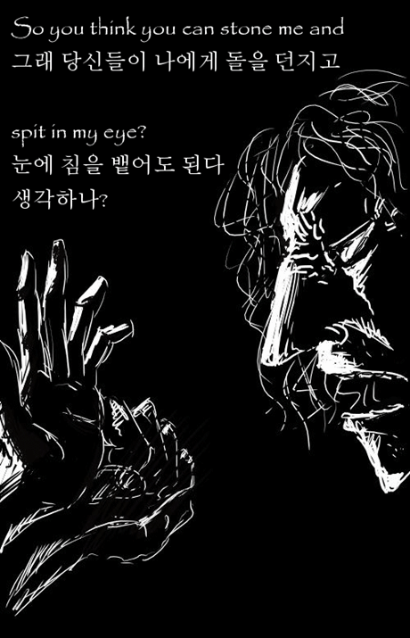

**2007.8.26.** **oculus님의 Bohemian Rhapsody 그림**  
  
사실 보헤미안 랩소디의 가사는 여러 해석본이 존재한다. 어쨌든 oculus님의 그림에는 영감이 느껴진다.  

<!-- truncate -->

[▶ 보러가기](http://gall.dcinside.com/list.php?id=hit&no=4834&page=1)

  

**2007.8.25.** **태권브이의 디자인표절 그리고 한국표절로봇들(추가)**  
정말 우리애니메이션을 사랑한다면, 지금이라도 늦지 않았다. 우리 어린세대에게 진실된 꿈과 희망을 안겨줘야 하지 않는가? 그것은 과거의 잘못을 인정하는것부터 출발한다. 왜 끝까지 표절한 부분을 감추려 드는지?? 돈보다도 중요한것이 있을텐데 말이다. 분명 스토리는 표절이 아니지만, 케릭터는 표절이다. 우리나라 메카 애니메이션의 역사는 표절의 역사.  
  
[▶ 보러가기](http://blog.naver.com/ninekimpd/110013877985)

  

**2007.8.23.** **1분기 신문업계 최대광고주, AIG보험**  
AIG손해보험은 이 기간 동안 신문을 포함한 TV·라디오·잡지 등 4대 매체에 모두 220억7037만1000원의 광고를 집행한 것으로 나타났으며, 이 가운데 67.9%를 신문사 광고에 할애해 10대 광고주 가운데 신문사 광고비 집행비율이 가장 높았다. AIG손해보험은 지난해에 비해 올해 인쇄매체 광고비를 85.2%나 늘리면서 1위로 뛰어올랐다. AIG의 사기행각이 보도되지 않는 이유와 관련이 있는 것 아닐까?  
  
[▶ 기사보기](http://www.mediatoday.co.kr/news/articleView.html?idxno=59716)  
  
[▶ 미디어오늘 - KBS "이명박 '치적' AIG, 제2 론스타 된다"](http://www.mediatoday.co.kr/news/articleView.html?idxno=60081)  
[▶ Vincent's Blog - AIG 띠링띠링~ 여전하신 MB님의 땅사랑](http://www.vincentkwak.com/120)  
[▶ ISSSSSUE - 한겨례, 경향에도 안보이는 AIG 특혜 보도. 이유는?](http://issue.tistory.com/316)

  

**2007.8.20.** **미스터 타이푼의 한글리쉬**  
  
크크. 재밌다. :)  
  
[▶ 보러가기](http://tvpot.daum.net/clip/ClipView.do?clipid=4018636)
