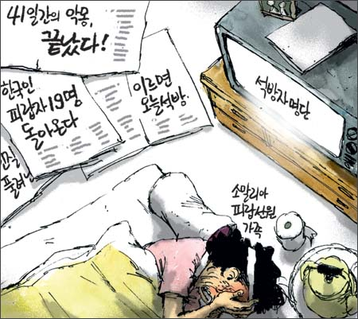
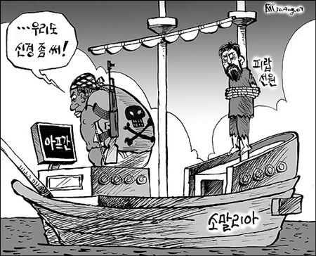

  

경향신문 8월 30일자  

<!-- truncate -->

  

한국일보 8월 30일자  
그러고 보면 정말 아프간에 끌려갔던 그들은 하느님의 은총으로 풀려났는지도 모르겠다. 하느님의 은총 때문인지, 하느님을 믿는 사람들의 노력 때문인지, 한 국가의 테러단체를 상대로 한 협상 때문인지는 잘 모르겠지만 사람들은 각자 자신들이 믿고 싶어하는 쪽으로 믿어가는 분위기.  
  
이럴 땐 차라리 예수천국, 불신지옥이든 뭐든 크게 이슈라도 되어 후에 구상권을 청구하든 세금으로 내주든 그들도 일단 데려와줬으면 하는 생각이 든다.
