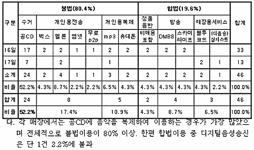

> 지도활동에 나선 단속팀 관계자는 “대형매장과 체인점포 외에 일반매장도 이번 단속 대상에 포함되어 있다”며, **“매장에서 음반을 공CD에 구워서 이용하거나 소리바다나 벅스, 멜론과 같은 개인용 음악서비스를 이용하는 경우에도 권리자가 사용 승인한 범위를 벗어난 경우 불법이용이 된다”**며 **“매장에서 정품음반을 사용하거나, 온라인 매장전용 음악서비스를 통하여 이용해야 한다”**고 전했다.  
>   
> 이에 앞서 음제협은 지난 7월부터 소리바다, 벅스, 멜론, 도시락, 엠넷닷컴 등 온라인음악서비스사업자의 회원가입 약관 개정 및 이에 대한 공지를 통해 개인감상용서비스는 영업장에서 이용할 수 없음을 명시하고 이를 일반에 충분히 공지하여, 잘못된 음원사용으로 피해를 입지 않도록 해줄 것을 당부했다.  
>   
> 출처 : [**사단법인 한국음원제작자협의회 보도자료**](http://www.kapp.or.kr/board/board.php?page=1&no=70&id=board_03) 중에서

<!-- truncate -->

  
그러고 보니 술집이나 커피숍 같은 곳을 보면 언제부터인지 컴퓨터로 음악을 틀더군요. 대부분의 그런 장소의 오디오 시스템 (혹은 PA)이 그리 좋지 않기 때문에 mp3나 스트리밍으로 틀어도 뭐 거의 지장이 없겠죠.  
  
사실 예전부터 궁금한 점이었어요. 예전에 공부할 때 외국은 매장에서 음악을 틀 때 음악사용료를 지불한다고 들었는데, 우리나라에서는 그런 이야기를 제대로 들어본 적이 없었거든요.  
  
  

표 출처 : 상동  
저는 늦었지만 잘 취한 조치라고 생각합니다. 사실 개인들에게는 편의를 위해 구입한 음원을 복제하거나 편집하는 행위, 혹은 상업적인 의도없이 팬의 입장에서 함께 즐기려는 행위 등에도 예외없는 원칙을 고수해온 반면 영리단체들에 대한 조치는 거의 없었거든요. 평상시에도 제 생각은 이러한 1차 저작물을 가지고 영리활동을 하는 사람(단체)들에게 더 적극적으로 저작권을 적용시켜야 한다는 입장이거든요.  
  
이건 현실적인 이유도 들어가는데, 결국 산업의 생산자, 유통자들끼리 합리적인 룰을 만드는 게 중요하다고 생각하기 때문입니다. 어지간히 큰 매장이 아니고서는 매장 안에서 음악을 틀어도 별다른 문제라고 생각하지 않지만 개인들은 개인적으로 친구들과 좋은 음악을 나눠 들어도 (복제를 하면) 불법이라는 인식이 있다는 건 뭔가 순서가 뒤바뀐 것 같거든요.  
  
제 생각에는 이렇게 b-to-b 모델에서 자신들의 입지를 충분히 쌓아올린 다음에 개개인의 소비자들에게 접근을 했어야 하는데 이제껏 음제협은 그렇지 못한 것 같아요. 다른 산업의 사업자들 (이통사, 디지털 음원 유통업자들)과 형편없는 조건으로 음원 수익에 대한 계약을 한 후에 점점 수익이 떨어진다고 설레발을 친 후 그걸 개인들의 책임으로만 전가하는 모습을 보여왔다고 생각해요.  
  
이제라도 조금씩 자신들의 몫을 찾아가는 음제협이 되기를 기대해봅니다. 그렇게 찾아온 몫이 창작자들에게 온전히 돌아간다는 전제하에 말이죠.
