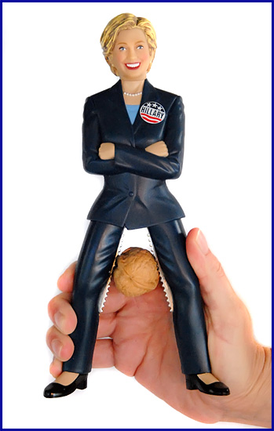

**2007.9.5.** **킥갤러 꺼츠의 나혜미 안티카페 점령기**  
나혜미 안티카페를 순식간에 나혜미 & 호나우딩요 팬카페로 둔갑시켜버린 꺼츠님. 안티카페를 운영하는 많은 학생들이 뜨끔할 만한 교훈적인 사건이라 할 수 있겠다. -o-  

<!-- truncate -->

[▶ 보러가기](http://gall.dcinside.com/list.php?id=hit&no=4690&page=4)  
[▶ 한겨레21 - [인터넷 스타] 안티카페 무혈 입성기](http://www.hani.co.kr/section-021107000/2007/07/021107000200707190669059.html)

  

**2007.9.3.** **힐러리 호두까기 인형 the Hillary Nutcracker**  
  
우리나라에서 이런 제품이 나왔다면 어떻게 됐을까? 자, 만약 박근혜 가랑이로 호두를 까는 호두까기 인형이 나왔다면? 심상정 호두까기 인형이라면? 반대세력의 음모네, 특검이네 뭐네 하면서 청와대의 배후가 의심스럽다 특검하자고 하지 않았을까? 도대체 유머를 아는 정치인을 바라는 게 그렇게도 어려운 일인걸까? 성범죄 일으키고, 성차별, 성폭력적인 발언들 하고 다니는 정치인은 많은데 말이지.   
  
[▶ 보러가기](http://www.hillarynutcracker.com/)
