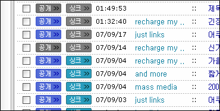

제가 속한 블로그 진영(?)은 이제 태터툴즈라는 이름을 과거로 만들고 새 이름 텍스트큐브를 가질 정도로 앞으로 나아가고 있는데, 제 블로그는 아직도 처음의 모습 그대로 - 태터툴즈 클래식입니다.  

<!-- truncate -->

태터툴즈 때도 판갈이를 하면 여러가지 편리한 기능이 있다는 걸 알고 있음에도 왠지 클래식 버전에 애착이 느껴져서 그동안 버전업을 하지 않았는데, 오늘 오랜만에 글을 써 보니 글쎄, 싱크가 안 먹는 거예요.  
  
  

이제 태터툴즈 클래식은 이올린으로의 싱크도 안되나 봅니다. ㅠ.ㅠ 마치 오래된 수도관을 사용하고 있어서 급수회사로부터 수돗물 공급이 끊기는 그런 느낌이랄까요? ;;;  
  
이제 정말 판갈이를 위한 시간이 다가왔나 싶어요.
