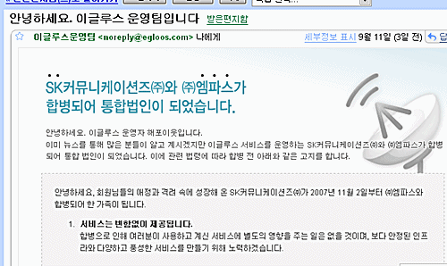

  

<!-- truncate -->

몇일 전에 받은 메일.  
  
SK커뮤니케이션즈에 인수된 이글루스 운영팀이 엠파스와 관련된 메일을 보내왔다.  
  
내부적으로는 어떻든 간에 이렇게 닥치는 대로 일하는 듯한 모습을 보여서 그리 좋을 건 없어 보인다. 왠지 전문성이 떨어져 보이잖아? SK가 그 동안 삽질했던 이유를 슬쩍 엿볼 수 있는 거라고 하면 너무 거창하지만.  
  
하기 뭐 개발자들에게 람보가 되길 [**강요**](http://itviewpoint.com/tt/index.php?pl=1348)하는 세상인데, 디자이너나 운영팀에게는 안 그럴꼬.
