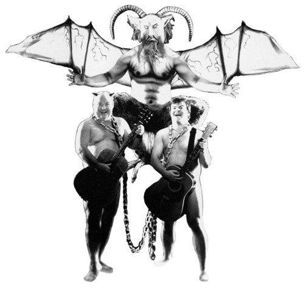

  

잭 블랙 (JB)과 카일 개스 (KG)의 테네이셔스 디 (Tenacious D)는 제가 좋아하는 밴드 중 하나입니다. 음악이 진지했던 시절인 80~90년대의 락씬에 대한 향수를 느끼게 해주거든요. 물론 너무나도 코믹한 두 사람의 강력한 포스 때문에 그게 표면에 잘 드러나지는 않죠. 하지만, 자세히 들어보면 탄탄한 음악적인 요소를 바탕으로 강한 자뻑(^^), 공들인 멜로디, 좋은 연주력, 좋은 보컬 등 락 밴드가 가져야 할 미덕을 고루 갖추고 있는 밴드입니다.  

<!-- truncate -->

  
Tenacious D - Tribute  
  
  
라이브 버전. 앞 부분에 시스템 오브 던의 곡을 커버하기도 했네요.  
자막이 흐릿하긴 한데, 2002년도 인 듯 합니다.  
시드니의 채널 [V]를 통해 녹화된 화면입니다.  
어쨌든 이 테네이셔스 디의 히트곡이라 할 수 있는 Tribute의 뮤직비디오는 이들의 컨셉이 어떤지를 잘 보여줬었죠. 많은 사람들이 좋아라 하는 바로 그 클립입니다.  
  
<스쿨 오브 락>과 <킹콩>의 재치있는 코미디 배우 잭 블랙이 취미생활로 하는 밴드 정도로 알고 있는 분들도 많은데, 사실 이 밴드의 역사는 짧지 않습니다. 그들은 오래 전부터 꾸준히 TV쇼를 통해 그들의 재능을 알리고, 팬층을 두텁게 하며 성장해 왔죠.  
  
[TD\_HBO\_greatestbandonearth.gif](./TD_HBO_greatestbandonearth.gif)Tribute라는 곡 역시 원래 1999년 HBO에서 방영된 TV 시리즈에서 먼저 소개된 곡입니다. 시리즈의 제목은 바로 테에이셔스 디 : 세상에서 제일 위대한 밴드 (Tenacious D : The Greatest Band on Earth) 이고, 총 6편으로 이루어져 있죠. 각각의 편을 통해 잭 블랙과 카일 개스는 위대한 밴드 (혹은 성공한 밴드)가 되기 위한 여정을 보여줍니다. 각 편마다 이들은 스탠딩 무대에 서서 노래를 들려줍니다. 단순히 코미디 시리즈에서 시간을 떼우거나 하는 수준이 아니예요. 곡 자체도 좋을 뿐더러 매편 퍼포먼스를 벌이는 JB와 KG의 하모니도 멋지거든요.  
  
[Tenacious-D-In-The-Pick-Of-Destiny-Posters.jpg](./Tenacious-D-In-The-Pick-Of-Destiny-Posters.jpg)이 10분짜리 포맷의 성공 이후로 테네이셔스 디는 30분짜리 시리즈를 기획하지만 HBO와의 계약이 종료되고 아쉽게도 서로의 이해관계가 맞지 않아 이 기획은 흐지부지 되게 됩니다. 하지만, 여기서 멈출 JB + KG가 아니죠. 그들은 아예 더 큰 기획을 합니다. 바로 영화 <테네이셔스 디 : 운명의 피크> (Tenacious D in the Pick of Destiny) 가 바로 그것이죠.  
  
그리고, 이 영화는 팬들을 열광시켰죠. 저도 무척 재밌게 봤습니다. 어떻게 보면 뻔한 코미디이기도 하지만, 그들의 실제 경험담을 재치있게 꾸민듯한 이야기들을 보고 있으니 음악에 대한 열정이 물씬 느껴지더라고요. 그 점이 가장 좋았습니다. 웃기지만 열정! :)  
  
언제나 사람들에게 즐거움을 줄 수 있는 그들의 기본적인 태도를 바탕으로 음악적으로도 탄탄한 실력을 자랑하는 그들의 차후 행보가 기대됩니다.  
  
  

p.s. 영화배우로도 주가가 많이 오른 잭 블랙의 경우는 현재 미셸 공드리 감독의 차기작 <Be Kind Rewind>와 음악영화인 <Walk Hard: The Dewey Cox Story>에 출연을 마친 상태이고, 쿵후를 배워 적들과 싸우는 팬더가 주인공인 애니메이션 <Kung Fu Panda>에 성룡, 안젤리나 졸리, 더스틴 호프만, 루시 리우 등과 함께 목소리를 빌려주기도 했죠.  
  

**Tenacious D - The Greatest Band on Earth**  
  
  
Tenacious D Episode 1 The Search for Inspirado (1/2)  
  
  
Tenacious D Episode 1 The Search for Inspirado (2/2)  
  
  
Tenacious D Episode 2 - Angel in Disguise (1/2)  
  
  
Tenacious D Episode 2 - Angel in Disguise (2/2)  
  
  
Tenacious D Episode 3 - Death of the Dream (1/2)  
  
  
Tenacious D Episode 3 - Death of the Dream (2/2)  
  
  
Tenacious D - Greatest Song in the World  
**(여기에 Tribute의 초기버전이 나옵니다. 편곡도 좀 다르죠.)**  
  
  
Tenacious D Episode 5 - The Fan (1/2)  
  
  
Tenacious D Episode 5 - The Fan (2/2)  
  
  
Tenacious D Episode 6 - Road Gig (1/2)  
  
  
Tenacious D Episode 6 - Road Gig (2/2)
